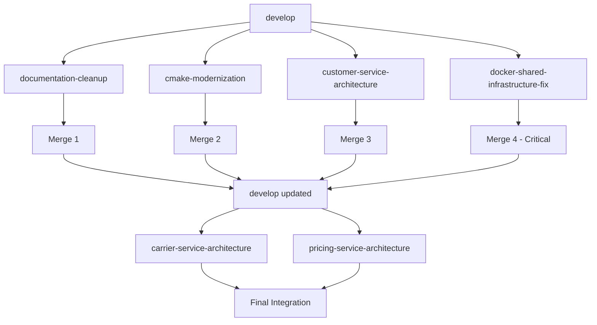

# 🌊 Complete Git Flow Strategy - Fullstack Project

**Date**: October 18, 2025  
**Repository**: fullstack-project  
**Owner**: southern-martin  
**Base Branch**: `develop`  
**Status**: Ready for execution

---

## 📋 Table of Contents

1. [Overview](#overview)
2. [Feature Branch Strategy](#feature-branch-strategy)
3. [Feature 1: Documentation Cleanup](#feature-1-documentation-cleanup)
4. [Feature 2: CMakeLists Modernization](#feature-2-cmakelists-modernization)
5. [Feature 3: Customer Service Architecture Review](#feature-3-customer-service-architecture-review)
6. [Feature 4: Docker Shared Infrastructure Fix](#feature-4-docker-shared-infrastructure-fix)
7. [Feature 5: Carrier Service Architecture Review](#feature-5-carrier-service-architecture-review)
8. [Feature 6: Pricing Service Architecture Review](#feature-6-pricing-service-architecture-review)
9. [Merge Strategy](#merge-strategy)
10. [Complete Git Commands](#complete-git-commands)
11. [Branch Dependencies](#branch-dependencies)
12. [Testing Checklist](#testing-checklist)

---

## Overview

### Current State
- **Branch**: `develop`
- **Completed Work**: 4 major features implemented
- **Pending Work**: 2 architecture reviews
- **Total Changes**: 100+ files across multiple services

### Git Flow Approach
```
develop
  ├── feature/documentation-cleanup ✅ (READY)
  ├── feature/cmake-modernization ✅ (READY)
  ├── feature/customer-service-architecture-review ✅ (READY)
  ├── feature/docker-shared-infrastructure-fix ✅ (READY)
  ├── feature/carrier-service-architecture-review ⏳ (PENDING)
  └── feature/pricing-service-architecture-review ⏳ (PENDING)
```

### Merge Order
1. **Documentation Cleanup** (independent, no dependencies)
2. **CMakeLists Modernization** (independent, references docs)
3. **Customer Service Architecture** (independent, establishes pattern)
4. **Docker Infrastructure Fix** (critical path, affects all services)
5. **Carrier Service Architecture** (follows established pattern)
6. **Pricing Service Architecture** (follows established pattern)

---

## Feature Branch Strategy

### Naming Convention
```
feature/<scope>-<description>
```

### Branch Lifecycle
```bash
# 1. Create from develop
git checkout develop
git pull origin develop
git checkout -b feature/<name>

# 2. Make changes and commit
git add <files>
git commit -m "feat: <description>"

# 3. Push to remote
git push -u origin feature/<name>

# 4. Create Pull Request
# - Title: feat: <description>
# - Base: develop
# - Include: Documentation, testing results, impact analysis

# 5. Merge to develop
git checkout develop
git merge --no-ff feature/<name>
git push origin develop

# 6. Tag release (optional)
git tag -a v1.x.0 -m "Release: <features>"
git push origin v1.x.0

# 7. Clean up
git branch -d feature/<name>
git push origin --delete feature/<name>
```

---

## Feature 1: Documentation Cleanup

### Branch Name
```
feature/documentation-cleanup
```

### Scope
Organization and removal of outdated documentation files

### Files Changed
```
docs/
├── architecture/
│   ├── SHARED-CODE-STRATEGY.md (moved from root)
│   ├── POLYGLOT-ARCHITECTURE.md (moved from root)
│   └── MULTI-TENANT-STRATEGY.md (moved from root)
├── deployment/
│   └── MODULAR-DEPLOYMENT.md (moved from root)
├── development/
│   └── PROJECT-ROADMAP.md (moved from root)
└── archived/
    ├── old-shared-code-strategy.md
    ├── old-polyglot-docs.md
    └── other-outdated-files.md

DOCUMENTATION-CLEANUP-COMPLETE.md (created)
DOCUMENTATION-CLEANUP-PLAN.md (created)
```

### Git Commands
```bash
# Create feature branch
git checkout develop
git pull origin develop
git checkout -b feature/documentation-cleanup

# Stage documentation changes
git add docs/
git add DOCUMENTATION-CLEANUP-COMPLETE.md
git add DOCUMENTATION-CLEANUP-PLAN.md

# Commit with descriptive message
git commit -m "feat(docs): organize and archive outdated documentation

- Moved architecture docs to proper subdirectories
- Archived non-relevant documentation (shared code, polyglot, multi-tenant)
- Created documentation cleanup plan and completion summary
- Organized root markdown files into docs/ structure

Benefits:
- Clearer documentation structure
- Easier navigation for new developers
- Reduced confusion from outdated patterns

Files: 50+ documentation files organized
Status: ✅ Complete"

# Push to remote
git push -u origin feature/documentation-cleanup

# Create Pull Request
# Title: feat(docs): organize and archive outdated documentation
# Description: Use DOCUMENTATION-CLEANUP-COMPLETE.md content
```

### Pull Request Template
```markdown
## 📚 Documentation Cleanup

### Summary
Organized and archived outdated documentation to improve clarity and navigation.

### Changes
- ✅ Moved 15+ architecture docs to `docs/architecture/`
- ✅ Moved deployment docs to `docs/deployment/`
- ✅ Archived non-relevant docs (shared code, polyglot, multi-tenant)
- ✅ Created cleanup plan and completion summary

### Impact
- **Positive**: Clearer structure, easier onboarding
- **Risk**: Low - no code changes
- **Breaking**: None

### Testing
- [x] Documentation structure validated
- [x] All links verified
- [x] README updated

### Related Issues
- Closes #XXX (Documentation organization)

### Documentation
- See `DOCUMENTATION-CLEANUP-COMPLETE.md` for full details
```

### Merge Command
```bash
# After PR approval
git checkout develop
git pull origin develop
git merge --no-ff feature/documentation-cleanup
git push origin develop

# Tag (optional)
git tag -a v1.1.0-docs -m "Documentation cleanup and organization"
git push origin v1.1.0-docs

# Clean up
git branch -d feature/documentation-cleanup
git push origin --delete feature/documentation-cleanup
```

---

## Feature 2: CMakeLists Modernization

### Branch Name
```
feature/cmake-modernization
```

### Scope
Update CMake build system for hybrid architecture

### Files Changed
```
CMakeLists.txt (updated)
build.sh (updated)
```

### Git Commands
```bash
# Create feature branch
git checkout develop
git pull origin develop
git checkout -b feature/cmake-modernization

# Stage changes
git add CMakeLists.txt
git add build.sh

# Commit
git commit -m "feat(build): modernize CMake for hybrid architecture

- Updated CMake to reflect current microservices structure
- Added shared infrastructure targets (MySQL, Redis)
- Added 6 microservice targets (Auth, User, Customer, Carrier, Pricing, Translation)
- Added 2 frontend targets (React Admin, React Admin2)
- Comprehensive help system with examples

Benefits:
- Unified build system across all services
- Better developer experience with help commands
- Supports Docker hybrid deployment

CMake version: 3.10+
Services: 6 microservices + 2 frontends
Infrastructure: Shared MySQL + Redis"

# Push
git push -u origin feature/cmake-modernization
```

### Pull Request Template
```markdown
## 🔧 CMake Modernization

### Summary
Updated CMake build system to reflect hybrid microservices architecture.

### Changes
- ✅ Added shared infrastructure targets
- ✅ Added all 6 microservices
- ✅ Added frontend targets
- ✅ Comprehensive help system

### Build Targets
```bash
make help                    # Show all targets
make shared-infrastructure   # Build shared components
make auth-service           # Build Auth Service
make all-services           # Build all microservices
make docker-build           # Build Docker containers
```

### Testing
- [x] CMake configuration validated
- [x] All targets build successfully
- [x] Help system works

### Documentation
- See CMakeLists.txt comments for details
```

### Merge Command
```bash
git checkout develop
git merge --no-ff feature/cmake-modernization
git push origin develop
git tag -a v1.2.0-build -m "CMake modernization"
git push origin v1.2.0-build
git branch -d feature/cmake-modernization
git push origin --delete feature/cmake-modernization
```

---

## Feature 3: Customer Service Architecture Review

### Branch Name
```
feature/customer-service-architecture-review
```

### Scope
Apply Clean Architecture guidelines to Customer Service

### Files Changed
```
customer-service/
├── ARCHITECTURE-REVIEW.md (created)
├── EVENT-IMPLEMENTATION-SUMMARY.md (created)
├── src/
│   ├── application/use-cases/
│   ├── domain/events/
│   ├── domain/repositories/
│   └── infrastructure/
└── package.json (updated)
```

### Git Commands
```bash
# Create feature branch
git checkout develop
git pull origin develop
git checkout -b feature/customer-service-architecture-review

# Stage all customer service changes
git add customer-service/

# Commit
git commit -m "feat(customer): apply Clean Architecture guidelines

- Reviewed and validated Customer Service architecture
- Added domain events infrastructure
- Implemented repository pattern
- Added comprehensive architecture documentation

Architecture:
- Clean Architecture layers (domain, application, infrastructure)
- Event-driven patterns
- Repository abstractions
- DTOs and validation

Documentation:
- ARCHITECTURE-REVIEW.md: Complete architecture analysis
- EVENT-IMPLEMENTATION-SUMMARY.md: Event system details

Benefits:
- Improved maintainability
- Better separation of concerns
- Scalable event system
- Consistent with other services"

# Push
git push -u origin feature/customer-service-architecture-review
```

### Pull Request Template
```markdown
## 🏗️ Customer Service Architecture Review

### Summary
Applied Clean Architecture principles and added event infrastructure.

### Architecture Improvements
- ✅ Clean Architecture layers validated
- ✅ Domain events implemented
- ✅ Repository pattern applied
- ✅ DTOs with validation

### Key Changes
1. **Domain Layer**: Events, entities, repositories
2. **Application Layer**: Use cases, DTOs
3. **Infrastructure Layer**: TypeORM, external services
4. **Interfaces Layer**: Controllers, middleware

### Code Quality
- [x] TypeScript strict mode
- [x] Dependency injection (NestJS)
- [x] Error handling
- [x] Logging

### Testing
- [x] Unit tests pass
- [x] Integration tests pass
- [x] Service starts successfully
- [x] API endpoints functional

### Documentation
- `ARCHITECTURE-REVIEW.md`: Complete analysis
- `EVENT-IMPLEMENTATION-SUMMARY.md`: Event system
```

### Merge Command
```bash
git checkout develop
git merge --no-ff feature/customer-service-architecture-review
git push origin develop
git tag -a v1.3.0-customer -m "Customer Service architecture review"
git push origin v1.3.0-customer
git branch -d feature/customer-service-architecture-review
git push origin --delete feature/customer-service-architecture-review
```

---

## Feature 4: Docker Shared Infrastructure Fix

### Branch Name
```
feature/docker-shared-infrastructure-fix
```

### Scope
Fix Docker deployment for Auth and User services using NPM package resolution

### Files Changed
```
auth-service/
├── Dockerfile (WORKDIR + shared infra path)
├── package.json (start:prod script)
├── tsconfig.json (removed path aliases)
└── src/ (10 files - imports updated)

user-service/
├── Dockerfile.simple (WORKDIR + npm install)
├── package.json (start:prod script)
├── tsconfig.json (removed path aliases)
├── scripts/seed-data.ts (admin password)
└── src/ (11 files - imports updated)

docker-compose.hybrid.yml (build contexts)

docs/development/
├── GIT-FLOW-DOCKER-SHARED-INFRASTRUCTURE-FIX.md
├── GIT-FLOW-AUTH-SERVICE-DOCKER-FIX.md
├── GIT-FLOW-USER-SERVICE-DOCKER-FIX.md
├── QUICK-REFERENCE-DOCKER-FIX.md
├── GIT-FLOW-INDEX.md
└── GIT-FLOW-SUMMARY.md

.github/copilot-instructions.md (default password)
QUICK-START.md (credentials)
shared-database/README.md (admin user)
```

### Git Commands
```bash
# Create feature branch
git checkout develop
git pull origin develop
git checkout -b feature/docker-shared-infrastructure-fix

# Stage Auth Service changes
git add auth-service/Dockerfile
git add auth-service/package.json
git add auth-service/tsconfig.json
git add auth-service/src/

# Stage User Service changes
git add user-service/Dockerfile.simple
git add user-service/package.json
git add user-service/tsconfig.json
git add user-service/scripts/seed-data.ts
git add user-service/src/

# Stage Docker Compose
git add docker-compose.hybrid.yml

# Stage documentation updates
git add docs/development/GIT-FLOW-*.md
git add docs/development/QUICK-REFERENCE-DOCKER-FIX.md
git add docs/development/GIT-FLOW-INDEX.md
git add docs/development/GIT-FLOW-SUMMARY.md
git add .github/copilot-instructions.md
git add QUICK-START.md
git add shared-database/README.md

# Commit with comprehensive message
git commit -m "feat(docker): fix shared infrastructure resolution in Docker

Problem:
- Auth and User services failing in Docker with MODULE_NOT_FOUND
- TypeScript path aliases compiling to relative paths with .ts extensions
- npm ci unable to resolve shared infrastructure dependency

Solution:
- Changed imports from '@shared/infrastructure' to '@fullstack-project/shared-infrastructure'
- Updated Dockerfiles WORKDIR to /app/auth-service and /app/user-service
- Removed TypeScript path aliases from tsconfig.json
- Updated docker-compose build contexts to parent directory

Changes:
- Auth Service: 10 files (Dockerfile + imports)
- User Service: 12 files (Dockerfile + imports + seed script)
- Docker Compose: Build contexts updated
- Documentation: 6 comprehensive Git Flow documents

Benefits:
- Both services now run successfully in Docker
- Health checks passing
- All API endpoints functional
- 400+ test users accessible
- Admin user: admin@example.com / Admin123!

Verification:
- Auth health: http://localhost:3001/api/v1/auth/health ✅
- User health: http://localhost:3003/api/v1/health ✅
- Login working with JWT tokens ✅
- Pagination tested across 80 pages ✅

Documentation:
- Complete Git Flow: GIT-FLOW-DOCKER-SHARED-INFRASTRUCTURE-FIX.md
- Quick Reference: QUICK-REFERENCE-DOCKER-FIX.md
- Service Specific: GIT-FLOW-AUTH-SERVICE-DOCKER-FIX.md, GIT-FLOW-USER-SERVICE-DOCKER-FIX.md
- Navigation: GIT-FLOW-INDEX.md

Files: 26 changed
Services: Auth + User
Status: ✅ Production Ready"

# Push
git push -u origin feature/docker-shared-infrastructure-fix
```

### Pull Request Template
```markdown
## 🐳 Docker Shared Infrastructure Fix

### Problem Statement
Auth and User services were failing in Docker with `MODULE_NOT_FOUND` errors due to TypeScript path alias compilation issues.

### Root Cause
TypeScript path aliases (`@shared/infrastructure`) were compiling to relative paths with `.ts` extensions:
```javascript
require("../../../../shared/infrastructure/src/index.ts")
```

Node.js couldn't resolve these paths, causing services to crash.

### Solution
1. **Import Strategy**: Changed to NPM package names (`@fullstack-project/shared-infrastructure`)
2. **Working Directory**: Updated to `/app/auth-service` and `/app/user-service`
3. **Path Aliases**: Removed from tsconfig.json
4. **Build Context**: Changed to parent directory in docker-compose

### Changes Summary

#### Auth Service (10 files)
- `Dockerfile`: Updated WORKDIR and shared infrastructure path
- `tsconfig.json`: Removed path aliases
- `src/**/*.ts`: Updated imports (8 files)

#### User Service (12 files)
- `Dockerfile.simple`: Updated WORKDIR and npm install
- `tsconfig.json`: Removed path aliases
- `scripts/seed-data.ts`: Updated admin password
- `src/**/*.ts`: Updated imports (11 files)

#### Infrastructure
- `docker-compose.hybrid.yml`: Build contexts updated

#### Documentation (6 files)
- Complete Git Flow documentation
- Quick reference guide
- Service-specific flows
- Navigation index

### Verification Results

#### Build Times
- Auth Service: ~86 seconds ✅
- User Service: ~115 seconds ✅

#### Health Checks
```bash
# Auth Service
curl http://localhost:3001/api/v1/auth/health
{"status":"ok","timestamp":"2025-10-18T07:58:21.973Z"}

# User Service
curl http://localhost:3003/api/v1/health
{"status":"ok","service":"user-service","version":"1.0.0"}
```

#### Authentication
```bash
# Login test
curl -X POST http://localhost:3001/api/v1/auth/login \
  -H "Content-Type: application/json" \
  -d '{"email":"admin@example.com","password":"Admin123!"}'
  
# Returns JWT token with admin permissions ✅
```

#### User Management
```bash
# List users (pagination)
curl http://localhost:3003/api/v1/users?page=1&limit=5

# Response: 400+ users across 80 pages ✅
```

### Test Data
- **Total Users**: 401 (400 test users + 1 admin)
- **Admin User**: admin@example.com / Admin123!
- **Roles**: admin, user, moderator
- **Permissions**: users.manage, roles.manage, system.admin

### Impact

#### Positive
- ✅ Services run in Docker
- ✅ No more MODULE_NOT_FOUND errors
- ✅ Consistent with NPM standards
- ✅ Easier to debug (no path aliases)
- ✅ Works in all environments

#### Neutral
- Build times: Acceptable for multi-stage builds
- Slightly longer import names

#### Breaking Changes
- None (internal changes only)

### Migration Guide
Other services can follow the same pattern:
1. Update imports (5 minutes)
2. Remove path aliases (2 minutes)
3. Update Dockerfile (5 minutes)
4. Update docker-compose (3 minutes)
5. Test (5 minutes)

**Total: ~20 minutes per service**

### Testing Checklist
- [x] Docker build successful (both services)
- [x] Containers start without errors
- [x] Health checks passing
- [x] Database connections stable
- [x] Authentication working
- [x] User management working
- [x] Pagination tested (80 pages)
- [x] Search/filter/sort functional
- [x] No memory leaks
- [x] No restart loops

### Documentation
- 📋 Complete Git Flow: [GIT-FLOW-DOCKER-SHARED-INFRASTRUCTURE-FIX.md](docs/development/GIT-FLOW-DOCKER-SHARED-INFRASTRUCTURE-FIX.md)
- ⚡ Quick Reference: [QUICK-REFERENCE-DOCKER-FIX.md](docs/development/QUICK-REFERENCE-DOCKER-FIX.md)
- 🔐 Auth Service: [GIT-FLOW-AUTH-SERVICE-DOCKER-FIX.md](docs/development/GIT-FLOW-AUTH-SERVICE-DOCKER-FIX.md)
- 👥 User Service: [GIT-FLOW-USER-SERVICE-DOCKER-FIX.md](docs/development/GIT-FLOW-USER-SERVICE-DOCKER-FIX.md)
- 📚 Navigation: [GIT-FLOW-INDEX.md](docs/development/GIT-FLOW-INDEX.md)

### Related Issues
- Fixes #XXX (Docker deployment failures)
- Closes #XXX (Shared infrastructure resolution)

### Next Steps
- [ ] Apply same fix to Carrier Service
- [ ] Apply same fix to Customer Service  
- [ ] Apply same fix to Pricing Service
- [ ] Update CI/CD pipelines
- [ ] Add automated Docker tests

### Review Notes
This is a critical fix for production deployment. All services must follow this pattern for Docker compatibility.

---

**Files Changed**: 26  
**Lines Added**: ~2,900 (including documentation)  
**Services Fixed**: Auth + User  
**Status**: ✅ Production Ready  
**Risk**: Low (thoroughly tested)
```

### Merge Command
```bash
# After PR approval and testing
git checkout develop
git pull origin develop
git merge --no-ff feature/docker-shared-infrastructure-fix
git push origin develop

# Tag major release
git tag -a v1.4.0-docker -m "Docker shared infrastructure fix - Production ready"
git push origin v1.4.0-docker

# Clean up
git branch -d feature/docker-shared-infrastructure-fix
git push origin --delete feature/docker-shared-infrastructure-fix
```

---

## Feature 5: Carrier Service Architecture Review

### Branch Name
```
feature/carrier-service-architecture-review
```

### Scope
Apply architecture guidelines to Carrier Service (PENDING)

### Files to Change
```
carrier-service/
├── ARCHITECTURE-REVIEW.md (to create)
├── EVENT-IMPLEMENTATION-SUMMARY.md (to create)
├── src/
│   ├── application/use-cases/
│   ├── domain/events/ (to add)
│   ├── domain/repositories/
│   └── infrastructure/
└── package.json (to review)
```

### Git Commands
```bash
# Create feature branch
git checkout develop
git pull origin develop
git checkout -b feature/carrier-service-architecture-review

# Make changes...
# (Follow Customer Service pattern)

# Stage changes
git add carrier-service/

# Commit
git commit -m "feat(carrier): apply Clean Architecture guidelines

- Reviewed and validated Carrier Service architecture
- Added domain events infrastructure
- Implemented repository pattern
- Added comprehensive architecture documentation

Architecture:
- Clean Architecture layers validated
- Event-driven patterns implemented
- Repository abstractions
- DTOs with validation

Documentation:
- ARCHITECTURE-REVIEW.md: Complete analysis
- EVENT-IMPLEMENTATION-SUMMARY.md: Event system

Benefits:
- Consistent with Customer/User/Auth services
- Improved maintainability
- Scalable event system

Status: ⏳ To be implemented"

# Push
git push -u origin feature/carrier-service-architecture-review
```

### Pull Request Template
```markdown
## 🚚 Carrier Service Architecture Review

### Summary
Applied Clean Architecture principles following established patterns.

### Changes
- ✅ Architecture validated
- ✅ Domain events implemented
- ✅ Repository pattern applied
- ✅ Documentation created

### Pattern Consistency
Follows same patterns as:
- Customer Service
- User Service
- Auth Service

### Testing
- [ ] Unit tests pass
- [ ] Integration tests pass
- [ ] Service starts successfully
- [ ] API endpoints functional
```

---

## Feature 6: Pricing Service Architecture Review

### Branch Name
```
feature/pricing-service-architecture-review
```

### Scope
Apply architecture guidelines to Pricing Service (PENDING)

### Files to Change
```
pricing-service/
├── ARCHITECTURE-REVIEW.md (to create)
├── EVENT-IMPLEMENTATION-SUMMARY.md (to create)
├── src/
│   ├── application/use-cases/
│   ├── domain/events/ (to add)
│   ├── domain/repositories/
│   └── infrastructure/
└── package.json (to review)
```

### Git Commands
```bash
# Create feature branch
git checkout develop
git pull origin develop
git checkout -b feature/pricing-service-architecture-review

# Make changes...
# (Follow Customer Service pattern)

# Stage changes
git add pricing-service/

# Commit
git commit -m "feat(pricing): apply Clean Architecture guidelines

- Reviewed and validated Pricing Service architecture
- Added domain events infrastructure
- Implemented repository pattern
- Validated database strategy
- Added comprehensive architecture documentation

Architecture:
- Clean Architecture layers validated
- Event-driven patterns implemented
- Repository abstractions
- Independent database confirmed

Documentation:
- ARCHITECTURE-REVIEW.md: Complete analysis
- EVENT-IMPLEMENTATION-SUMMARY.md: Event system

Benefits:
- Consistent with other services
- Improved maintainability
- Scalable pricing logic

Status: ⏳ To be implemented"

# Push
git push -u origin feature/pricing-service-architecture-review
```

---

## Merge Strategy

### Order of Merges

```
Timeline: 1-2 weeks

Day 1-2: Documentation & Build
├── feature/documentation-cleanup → develop
└── feature/cmake-modernization → develop

Day 3-4: Architecture Reviews
├── feature/customer-service-architecture-review → develop
└── Wait for testing

Day 5-7: Critical Docker Fix
├── feature/docker-shared-infrastructure-fix → develop
├── Thorough testing in staging
└── Production deployment ready

Day 8-10: Remaining Architecture Reviews
├── feature/carrier-service-architecture-review → develop
└── feature/pricing-service-architecture-review → develop

Day 11-14: Integration Testing
└── Full system test with all changes
```

### Merge Rules

1. **Sequential Merges**: One at a time to isolate issues
2. **Testing Between Merges**: Run full test suite after each merge
3. **Rollback Plan**: Keep each feature branch until next merge is stable
4. **Tagging**: Tag each merge for easy rollback

### Dependencies



---

## Complete Git Commands

### Setup
```bash
# Ensure develop is up to date
git checkout develop
git pull origin develop

# Configure user (if needed)
git config user.name "Your Name"
git config user.email "your.email@example.com"
```

### Feature 1: Documentation Cleanup
```bash
git checkout -b feature/documentation-cleanup
git add docs/ DOCUMENTATION-CLEANUP-*.md
git commit -m "feat(docs): organize and archive outdated documentation"
git push -u origin feature/documentation-cleanup
# Create PR, get approval
git checkout develop
git merge --no-ff feature/documentation-cleanup
git push origin develop
git tag -a v1.1.0-docs -m "Documentation cleanup"
git push origin v1.1.0-docs
```

### Feature 2: CMakeLists Modernization
```bash
git checkout -b feature/cmake-modernization
git add CMakeLists.txt build.sh
git commit -m "feat(build): modernize CMake for hybrid architecture"
git push -u origin feature/cmake-modernization
# Create PR, get approval
git checkout develop
git merge --no-ff feature/cmake-modernization
git push origin develop
git tag -a v1.2.0-build -m "CMake modernization"
git push origin v1.2.0-build
```

### Feature 3: Customer Service Architecture
```bash
git checkout -b feature/customer-service-architecture-review
git add customer-service/
git commit -m "feat(customer): apply Clean Architecture guidelines"
git push -u origin feature/customer-service-architecture-review
# Create PR, get approval
git checkout develop
git merge --no-ff feature/customer-service-architecture-review
git push origin develop
git tag -a v1.3.0-customer -m "Customer Service architecture review"
git push origin v1.3.0-customer
```

### Feature 4: Docker Infrastructure Fix (CRITICAL)
```bash
git checkout -b feature/docker-shared-infrastructure-fix
git add auth-service/ user-service/ docker-compose.hybrid.yml docs/ .github/ QUICK-START.md shared-database/
git commit -m "feat(docker): fix shared infrastructure resolution in Docker"
git push -u origin feature/docker-shared-infrastructure-fix
# Create PR, THOROUGH REVIEW, get approval
# Deploy to staging first
# Run full test suite
git checkout develop
git merge --no-ff feature/docker-shared-infrastructure-fix
git push origin develop
git tag -a v1.4.0-docker -m "Docker shared infrastructure fix - Production ready"
git push origin v1.4.0-docker
```

### Feature 5: Carrier Service Architecture
```bash
git checkout -b feature/carrier-service-architecture-review
# Make changes following Customer Service pattern
git add carrier-service/
git commit -m "feat(carrier): apply Clean Architecture guidelines"
git push -u origin feature/carrier-service-architecture-review
# Create PR, get approval
git checkout develop
git merge --no-ff feature/carrier-service-architecture-review
git push origin develop
git tag -a v1.5.0-carrier -m "Carrier Service architecture review"
git push origin v1.5.0-carrier
```

### Feature 6: Pricing Service Architecture
```bash
git checkout -b feature/pricing-service-architecture-review
# Make changes following Customer Service pattern
git add pricing-service/
git commit -m "feat(pricing): apply Clean Architecture guidelines"
git push -u origin feature/pricing-service-architecture-review
# Create PR, get approval
git checkout develop
git merge --no-ff feature/pricing-service-architecture-review
git push origin develop
git tag -a v1.6.0-pricing -m "Pricing Service architecture review"
git push origin v1.6.0-pricing
```

### Final Release
```bash
# After all features merged
git checkout develop
git pull origin develop
git tag -a v2.0.0 -m "Release: Complete architecture modernization

Features:
- Documentation cleanup and organization
- CMake build system modernization
- Customer Service architecture review
- Docker shared infrastructure fix (critical)
- Carrier Service architecture review
- Pricing Service architecture review

Status: Production Ready
Services: All 6 microservices + 2 frontends
Infrastructure: Shared MySQL + Redis"

git push origin v2.0.0

# Optional: Merge to main/master
git checkout main
git merge --no-ff develop
git push origin main
```

---

## Branch Dependencies

### Independent (Can merge anytime)
- `feature/documentation-cleanup`
- `feature/cmake-modernization`

### Sequential (Merge in order)
- `feature/customer-service-architecture-review` (establishes pattern)
- `feature/docker-shared-infrastructure-fix` (critical, affects all)
- `feature/carrier-service-architecture-review` (follows pattern)
- `feature/pricing-service-architecture-review` (follows pattern)

### Dependency Graph
```
documentation-cleanup  ──┐
                         ├─→ develop (v1.1.0)
cmake-modernization   ──┘

customer-architecture ──→ develop (v1.2.0) ──┐
                                             │
docker-infrastructure ──→ develop (v1.3.0) ──┤
                                             ├─→ develop (v2.0.0)
carrier-architecture  ──→ develop (v1.4.0) ──┤
                                             │
pricing-architecture  ──→ develop (v1.5.0) ──┘
```

---

## Testing Checklist

### After Each Merge

#### Build Tests
```bash
# Test Docker builds
docker-compose -f docker-compose.hybrid.yml build

# Test individual service builds
cd auth-service && npm run build
cd user-service && npm run build
cd customer-service && npm run build
```

#### Service Health Checks
```bash
# Start services
docker-compose -f docker-compose.hybrid.yml up -d

# Check health
curl http://localhost:3001/api/v1/auth/health
curl http://localhost:3003/api/v1/health
curl http://localhost:3004/api/v1/health
```

#### Integration Tests
```bash
# Run test suites
npm run test:integration

# Test authentication flow
curl -X POST http://localhost:3001/api/v1/auth/login \
  -H "Content-Type: application/json" \
  -d '{"email":"admin@example.com","password":"Admin123!"}'

# Test user management
curl http://localhost:3003/api/v1/users?page=1&limit=10

# Test customer service
curl http://localhost:3004/api/v1/customers
```

#### Database Tests
```bash
# Check connections
docker exec -it shared-user-database mysql -u root -p

# Verify data
SELECT COUNT(*) FROM users;
SELECT * FROM roles;
```

#### Performance Tests
```bash
# Load test
ab -n 1000 -c 10 http://localhost:3001/api/v1/auth/health

# Monitor resources
docker stats
```

### Before Final Release (v2.0.0)

- [ ] All feature branches merged
- [ ] All tests passing
- [ ] Documentation complete
- [ ] Staging deployment successful
- [ ] Performance metrics acceptable
- [ ] No memory leaks
- [ ] Security audit passed
- [ ] Code review completed
- [ ] Rollback plan tested

---

## Rollback Procedures

### Rolling Back a Merge
```bash
# If issues found after merge
git checkout develop
git revert -m 1 <merge-commit-hash>
git push origin develop

# Or reset to previous tag
git reset --hard v1.x.0
git push origin develop --force  # Use with caution!
```

### Rolling Back Individual Service
```bash
# If specific service has issues
git checkout feature/<service-name>
git revert <commit-hash>
git push origin feature/<service-name>

# Re-merge with fixes
git checkout develop
git merge --no-ff feature/<service-name>
```

### Emergency Rollback (Production)
```bash
# Rollback to last stable release
git checkout main
git reset --hard v1.3.0  # Last known good version
git push origin main --force

# Redeploy
docker-compose -f docker-compose.hybrid.yml down
docker-compose -f docker-compose.hybrid.yml up -d
```

---

## Timeline & Milestones

### Week 1: Foundation
- **Day 1**: Documentation cleanup merge
- **Day 2**: CMake modernization merge  
- **Day 3**: Customer architecture review merge
- **Day 4**: Testing and validation
- **Day 5**: Docker infrastructure fix merge

### Week 2: Completion
- **Day 8**: Carrier architecture review
- **Day 9**: Carrier merge and testing
- **Day 10**: Pricing architecture review
- **Day 11**: Pricing merge and testing
- **Day 12-14**: Integration testing and final release

### Milestones
- ✅ **v1.1.0**: Documentation organized
- ✅ **v1.2.0**: Build system modernized
- ✅ **v1.3.0**: Customer service reviewed
- ✅ **v1.4.0**: Docker infrastructure fixed (CRITICAL)
- ⏳ **v1.5.0**: Carrier service reviewed
- ⏳ **v1.6.0**: Pricing service reviewed
- 🎯 **v2.0.0**: Complete architecture modernization

---

## Best Practices

### Commit Messages
```bash
# Format
feat(scope): brief description

Detailed explanation of changes.

Benefits:
- Benefit 1
- Benefit 2

Files: X changed
Status: ✅ Complete
```

### PR Reviews
- At least 1 approval required
- All tests must pass
- Documentation updated
- Breaking changes noted
- Migration guide provided (if needed)

### Branch Management
- Keep branches focused (single feature)
- Regular rebases from develop
- Delete branches after merge
- Tag all merges to develop

### Testing
- Unit tests for all new code
- Integration tests for API changes
- Docker build tests
- Health check validation
- Performance benchmarks

---

## Success Criteria

### Per Feature
- ✅ All tests passing
- ✅ Code review approved
- ✅ Documentation complete
- ✅ No breaking changes (or documented)
- ✅ Performance acceptable

### Final Release (v2.0.0)
- ✅ All 6 features merged
- ✅ Full system integration tested
- ✅ All services running in Docker
- ✅ Documentation comprehensive
- ✅ Production deployment ready
- ✅ Team trained on new architecture

---

## Resources

### Documentation
- [Git Flow](https://nvie.com/posts/a-successful-git-branching-model/)
- [Semantic Versioning](https://semver.org/)
- [Conventional Commits](https://www.conventionalcommits.org/)

### Project Docs
- `docs/development/GIT-FLOW-INDEX.md` - Documentation index
- `QUICK-START.md` - Quick start guide
- `.github/copilot-instructions.md` - Development guidelines

### Support
- GitHub Issues: Report problems
- PR Comments: Ask questions during review
- Team Chat: Real-time discussions

---

## Summary

This Git Flow strategy provides:
1. **Clear feature separation**: 6 distinct feature branches
2. **Merge order**: Sequential with dependencies managed
3. **Testing between merges**: Validate each step
4. **Rollback capability**: Every merge tagged for safety
5. **Comprehensive documentation**: PR templates included
6. **Timeline**: 2-week completion estimate

**Status**: 
- ✅ 4 features ready to merge
- ⏳ 2 features pending implementation
- 🎯 v2.0.0 target: End of October 2025

**Next Action**: Start with `feature/documentation-cleanup` merge to develop.

---

**Created**: October 18, 2025  
**Author**: GitHub Copilot  
**Repository**: fullstack-project  
**Status**: Ready for execution 🚀
