# 🚦 Architecture Decision Flowchart

## Decision Tree for Your Architecture Choice

## Your Current Situation Analysis

## Architecture Comparison Matrix

```mermaid
graph TB
    subgraph "Architecture Options"
        subgraph "Microservices Only"
            MS[✅ Service Independence<br/>✅ Technology Diversity<br/>✅ Independent Deployment<br/>❌ No Tenant Isolation<br/>❌ Single Client Only]
        end
        
        subgraph "Multi-Tenant Only"
            MT[✅ Tenant Isolation<br/>✅ Cost Efficiency<br/>✅ Feature Toggle<br/>❌ No Service Independence<br/>❌ Monolithic Deployment]
        end
        
        subgraph "Multi-Tenant Microservices"
            MTMS[✅ Service Independence<br/>✅ Technology Diversity<br/>✅ Independent Deployment<br/>✅ Tenant Isolation<br/>✅ Cost Efficiency<br/>✅ Feature Toggle<br/>✅ Perfect for Your Needs]
        end
    end
    
    style MTMS fill:#4caf50,color:#fff
    style MS fill:#ff9800,color:#fff
    style MT fill:#ff9800,color:#fff
```

## Implementation Roadmap

## Service Architecture Evolution

## Technology Stack Evolution

## Decision Summary

```mermaid
graph TD
    A[Your Crossroads] --> B{Analyze Requirements}
    
    B --> C[Multiple Clients?]
    C -->|Yes| D[Feature Toggle Needed?]
    C -->|No| E[Single Client Architecture]
    
    D -->|Yes| F[Service Independence?]
    D -->|No| G[Simple Multi-Tenant]
    
    F -->|Yes| H[Technology Diversity?]
    F -->|No| I[Multi-Tenant Monolith]
    
    H -->|Yes| I[🎯 MULTI-TENANT MICROSERVICES]
    H -->|No| J[Multi-Tenant with Boundaries]
    
    I --> K[✅ RECOMMENDED SOLUTION<br/>Perfect for your needs<br/>Best of both worlds<br/>Future-proof architecture]
    
    style K fill:#4caf50,color:#fff
    style I fill:#4caf50,color:#fff
    style A fill:#2196f3,color:#fff
```

## Why Multi-Tenant Microservices is Perfect for You

```mermaid
graph TB
    subgraph "Your Business Needs"
        BN1[Multiple Small Clients]
        BN2[CMS + Ecommerce Features]
        BN3[Cost-Efficient Platform]
        BN4[Feature Flexibility]
    end
    
    subgraph "Your Technical Needs"
        TN1[Service Independence]
        TN2[Technology Diversity]
        TN3[Independent Deployment]
        TN4[Scalability]
    end
    
    subgraph "Multi-Tenant Microservices Benefits"
        B1[✅ Tenant Isolation]
        B2[✅ Shared Authentication]
        B3[✅ Feature Toggle]
        B4[✅ Cost Efficiency]
        B5[✅ Service Independence]
        B6[✅ Technology Diversity]
        B7[✅ Independent Deployment]
        B8[✅ High Scalability]
    end
    
    BN1 --> B1
    BN2 --> B2
    BN3 --> B4
    BN4 --> B3
    
    TN1 --> B5
    TN2 --> B6
    TN3 --> B7
    TN4 --> B8
    
    style B1 fill:#4caf50,color:#fff
    style B2 fill:#4caf50,color:#fff
    style B3 fill:#4caf50,color:#fff
    style B4 fill:#4caf50,color:#fff
    style B5 fill:#4caf50,color:#fff
    style B6 fill:#4caf50,color:#fff
    style B7 fill:#4caf50,color:#fff
    style B8 fill:#4caf50,color:#fff
```

## Final Recommendation

**🎯 Choose Multi-Tenant Microservices Architecture!**

This architecture gives you:
- **Perfect Business Model**: Serve multiple clients with feature flexibility
- **Technical Excellence**: Service independence and technology diversity
- **Cost Efficiency**: Shared infrastructure with tenant isolation
- **Future-Proof**: Easy to scale and add new services
- **Best of Both Worlds**: Combines the benefits of both architectures

**Start with multi-tenant foundation, then extract microservices. This approach gives you immediate business value while building toward a scalable, maintainable architecture.**
