# Microservice-Oriented Architecture: Visual Data Flow Diagrams

## 1. Complete Request/Response Flow

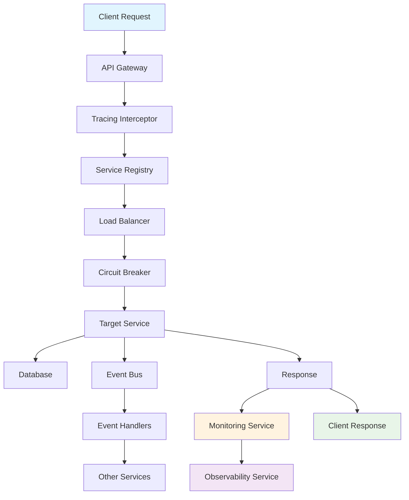

## 2. Service-to-Service Communication

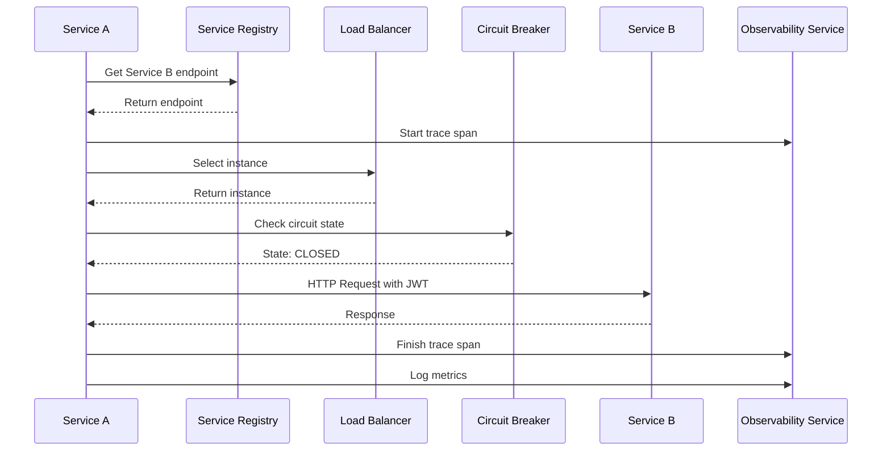

## 3. Event-Driven Communication

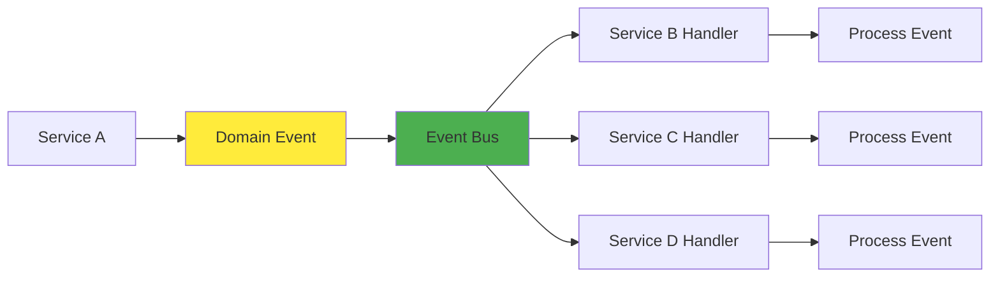

## 4. Monitoring & Observability Flow

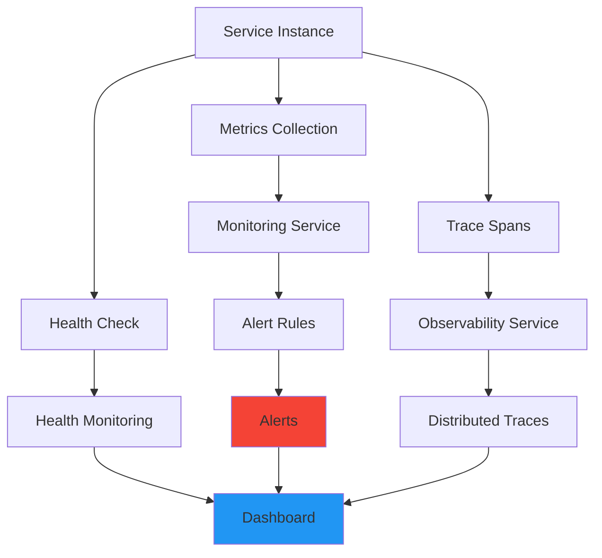

## 5. Circuit Breaker State Machine

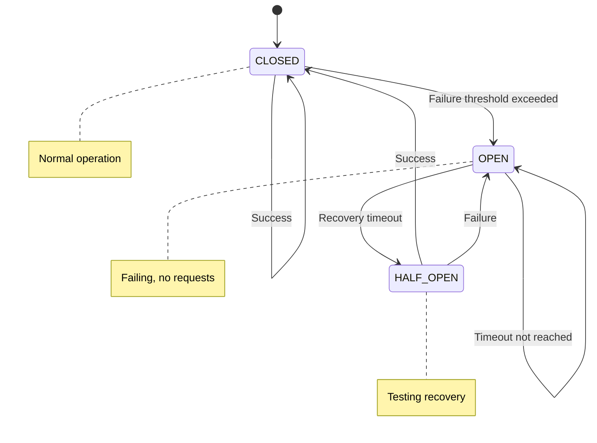

## 6. Load Balancing Strategies

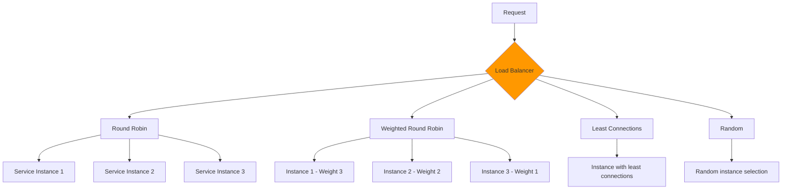

## 7. Authentication & Authorization Flow

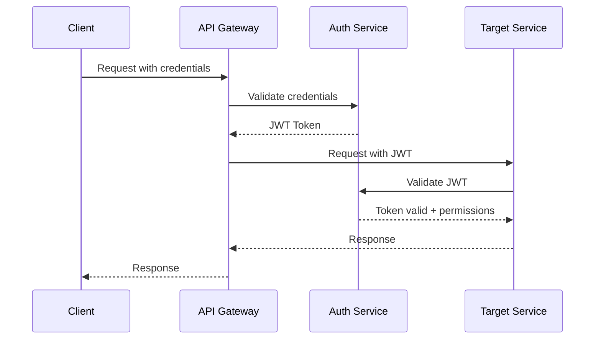

## 8. Error Handling & Recovery

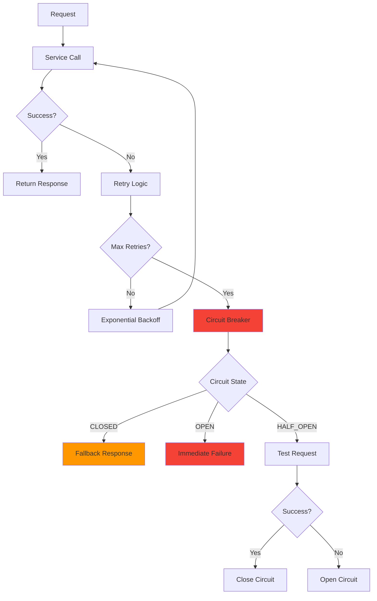

## 9. Data Persistence & Event Sourcing

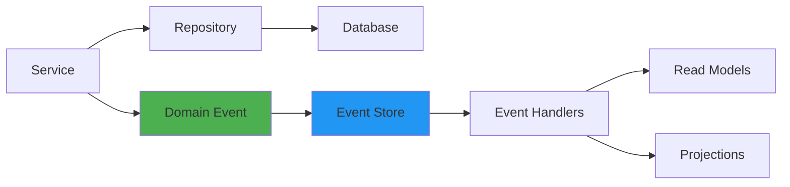

## 10. Complete System Architecture

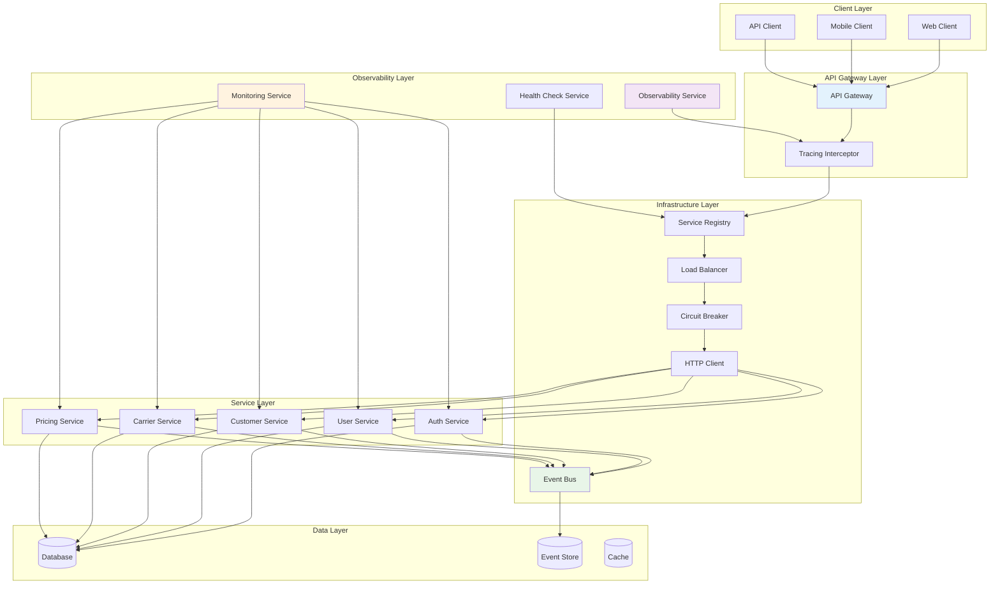

## 11. Request Lifecycle Timeline

```mermaid
gantt
    title Request Processing Timeline
    dateFormat X
    axisFormat %L ms
    
    section Request Processing
    API Gateway Processing    :0, 5
    Service Discovery        :5, 10
    Load Balancing          :10, 15
    Circuit Breaker Check   :15, 20
    Service Call            :20, 100
    Database Query          :25, 80
    Event Publishing        :85, 95
    Response Processing     :100, 105
    
    section Observability
    Trace Start             :0, 1
    Span Creation           :1, 2
    Metrics Collection      :20, 105
    Trace Completion        :105, 106
```

## 12. Error Scenarios & Recovery

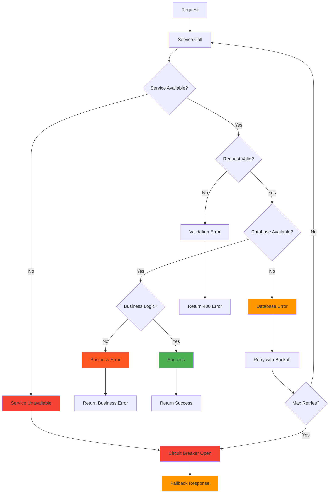

These diagrams provide a comprehensive visual representation of how data flows through the microservice-oriented architecture, showing the relationships between components, the sequence of operations, and the various patterns used for communication, monitoring, and error handling.
