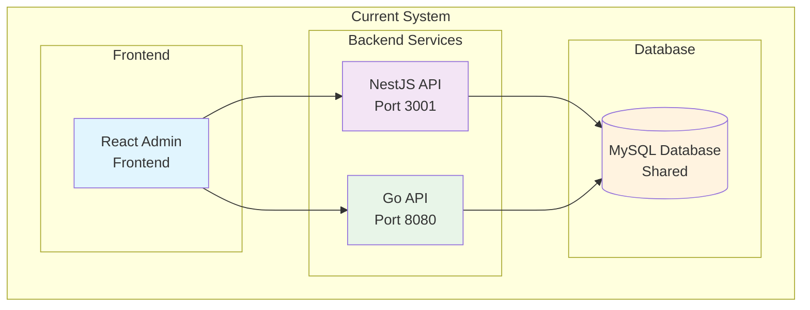
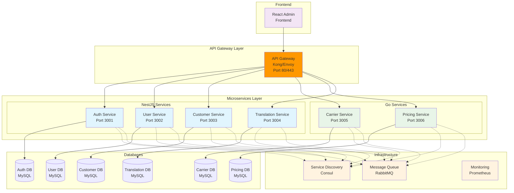
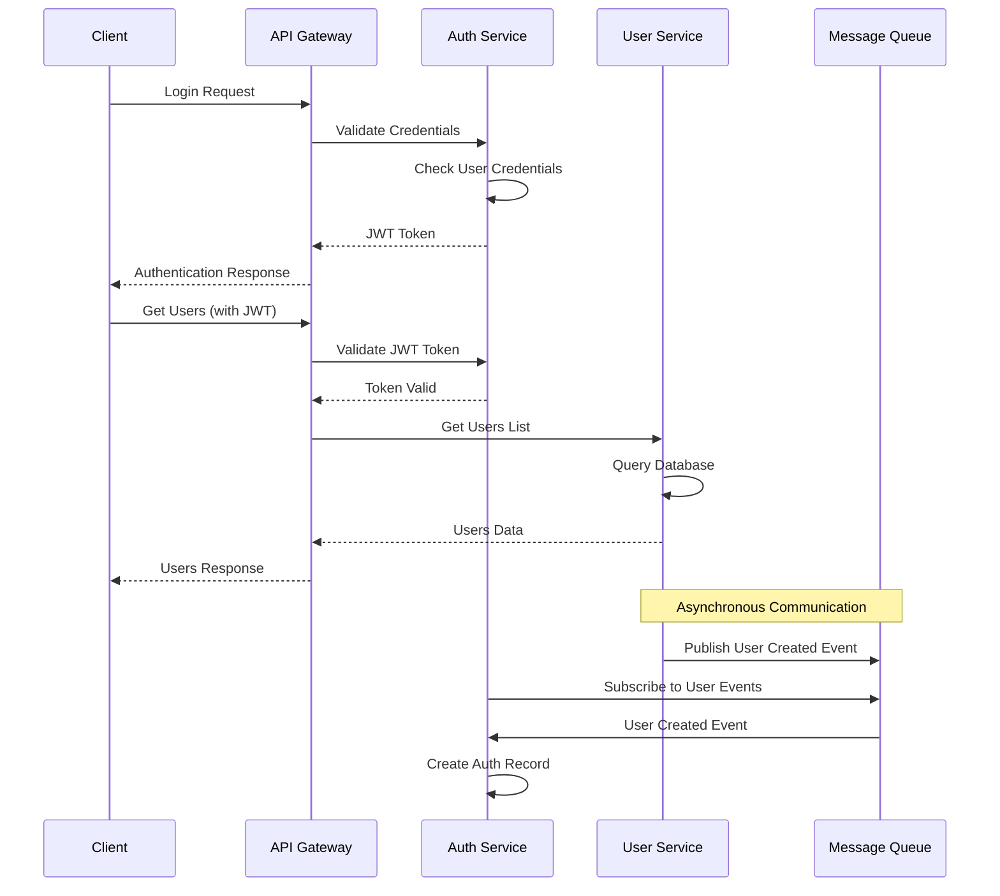
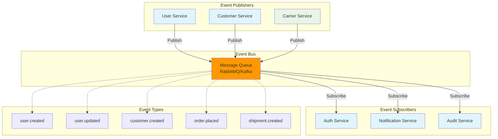
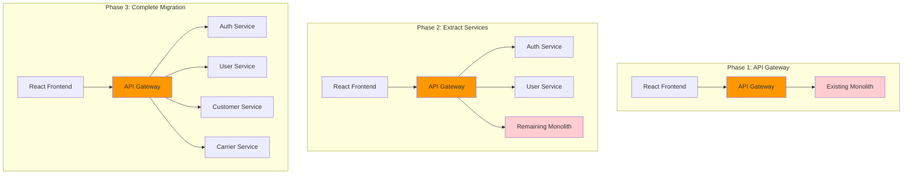
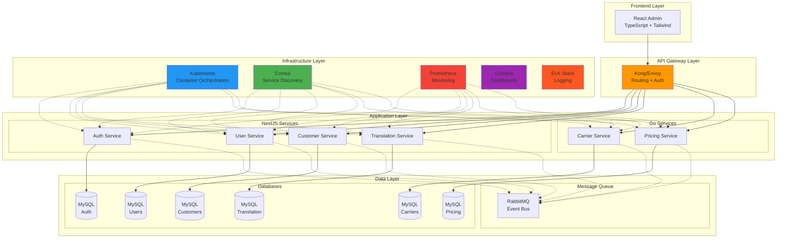
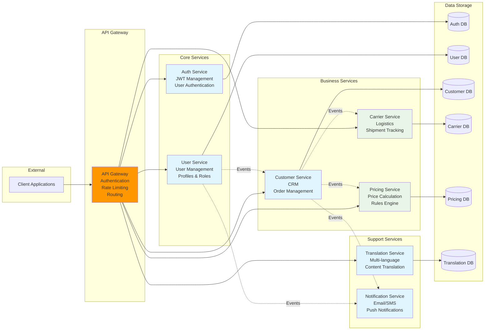

# 🏗️ Microservices Architecture Diagrams

## Current System Architecture

## Recommended Microservices Architecture

## Service Communication Flow

## Database per Service Architecture

```mermaid
graph TB
    subgraph "Service Boundaries"
        subgraph "Auth Service"
            AUTH_SVC[Auth Service]
            AUTH_DB[(Auth Database<br/>- users<br/>- roles<br/>- sessions)]
        end
        
        subgraph "User Service"
            USER_SVC[User Service]
            USER_DB[(User Database<br/>- profiles<br/>- preferences<br/>- settings)]
        end
        
        subgraph "Customer Service"
            CUST_SVC[Customer Service]
            CUST_DB[(Customer Database<br/>- customers<br/>- addresses<br/>- orders)]
        end
        
        subgraph "Carrier Service"
            CARR_SVC[Carrier Service]
            CARR_DB[(Carrier Database<br/>- carriers<br/>- routes<br/>- shipments)]
        end
        
        subgraph "Pricing Service"
            PRICE_SVC[Pricing Service]
            PRICE_DB[(Pricing Database<br/>- pricing_rules<br/>- price_history<br/>- discounts)]
        end
        
        subgraph "Translation Service"
            TRANS_SVC[Translation Service]
            TRANS_DB[(Translation Database<br/>- languages<br/>- translations<br/>- content)]
        end
    end
    
    AUTH_SVC --> AUTH_DB
    USER_SVC --> USER_DB
    CUST_SVC --> CUST_DB
    CARR_SVC --> CARR_DB
    PRICE_SVC --> PRICE_DB
    TRANS_SVC --> TRANS_DB
    
    style AUTH_SVC fill:#e1f5fe
    style USER_SVC fill:#e1f5fe
    style CUST_SVC fill:#e1f5fe
    style CARR_SVC fill:#e8f5e8
    style PRICE_SVC fill:#e8f5e8
    style TRANS_SVC fill:#e1f5fe
```

## Event-Driven Architecture

## Migration Strategy - Strangler Fig Pattern

## Technology Stack Architecture

## Service Dependencies and Data Flow

This comprehensive microservices architecture provides:

1. **Clear Service Boundaries**: Each service has a single responsibility
2. **Independent Deployment**: Services can be deployed independently
3. **Technology Diversity**: Mix of NestJS and Go services
4. **Scalability**: Each service can be scaled independently
5. **Fault Isolation**: Failure in one service doesn't affect others
6. **Event-Driven Communication**: Loose coupling between services
7. **Database per Service**: Data ownership and consistency
8. **Comprehensive Monitoring**: Full observability stack
