# 🏢 Multi-Tenant Platform Architecture Diagrams

## Multi-Tenant Platform Overview


## Tenant Isolation Strategies

### Database per Tenant Strategy


### Shared Database with Tenant Isolation


## Tenant Routing and Access Patterns

### Subdomain-Based Routing


### Path-Based Routing

```mermaid
graph LR
    subgraph "Path-Based Access"
        P1[/api/tenant/client1/cms/pages]
        P2[/api/tenant/client2/ecommerce/products]
        P3[/api/tenant/client3/cms/media]
    end
    
    subgraph "API Gateway"
        GW[API Gateway<br/>Path Parser]
    end
    
    subgraph "Route Resolution"
        RR[Route Resolver<br/>- Parse /tenant/{id}/<br/>- Extract service type<br/>- Validate permissions]
    end
    
    subgraph "Service Dispatch"
        AUTH[Auth Service]
        CMS[CMS Service]
        ECOM[Ecommerce Service]
    end
    
    P1 --> GW
    P2 --> GW
    P3 --> GW
    
    GW --> RR
    RR --> AUTH
    RR --> CMS
    RR --> ECOM
    
    style GW fill:#ff9800
    style RR fill:#e1f5fe
    style AUTH fill:#e1f5fe
    style CMS fill:#e8f5e8
    style ECOM fill:#e8f5e8
```

## Feature Toggle Architecture

### Tenant Feature Management

```mermaid
graph TB
    subgraph "Tenant Configuration"
        T1[Tenant 1<br/>Restaurant Chain]
        T2[Tenant 2<br/>Fashion Store]
        T3[Tenant 3<br/>Tech Blog]
    end
    
    subgraph "Feature Matrix"
        subgraph "Tenant 1 Features"
            T1_FEATURES[CMS: ✅<br/>Ecommerce: ✅<br/>Analytics: ✅<br/>Multi-lang: ❌]
        end
        
        subgraph "Tenant 2 Features"
            T2_FEATURES[CMS: ✅<br/>Ecommerce: ✅<br/>Analytics: ❌<br/>Multi-lang: ✅]
        end
        
        subgraph "Tenant 3 Features"
            T3_FEATURES[CMS: ✅<br/>Ecommerce: ❌<br/>Analytics: ❌<br/>Multi-lang: ❌]
        end
    end
    
    subgraph "Feature Service"
        FS[Feature Service<br/>- Check permissions<br/>- Route requests<br/>- Block unauthorized access]
    end
    
    T1 --> T1_FEATURES
    T2 --> T2_FEATURES
    T3 --> T3_FEATURES
    
    T1_FEATURES --> FS
    T2_FEATURES --> FS
    T3_FEATURES --> FS
    
    style FS fill:#ff9800
    style T1_FEATURES fill:#c8e6c9
    style T2_FEATURES fill:#c8e6c9
    style T3_FEATURES fill:#ffcdd2
```



## Authentication Flow in Multi-Tenant System

### Tenant-Aware Authentication


## Data Flow in Multi-Tenant System

### CMS Content Management Flow


### Ecommerce Order Processing Flow


## Frontend Multi-Tenant Architecture

### Tenant-Aware React Application


## Deployment Architecture

### Multi-Tenant Deployment Strategy


## Monitoring and Observability

### Multi-Tenant Monitoring


This comprehensive multi-tenant architecture provides:

1. **Complete Tenant Isolation**: Each client's data is completely separate
2. **Shared Authentication**: Single sign-on across CMS and Ecommerce features
3. **Feature Flexibility**: Enable/disable features per tenant
4. **Scalable Infrastructure**: Easy to add new tenants and scale services
5. **Cost Efficiency**: Shared infrastructure with tenant boundaries
6. **Security**: Tenant-aware authentication and authorization
7. **Monitoring**: Comprehensive observability with tenant context

The architecture supports your vision of a platform that can serve both CMS and Ecommerce functionality to multiple small clients while maintaining complete isolation and shared authentication! 🚀
