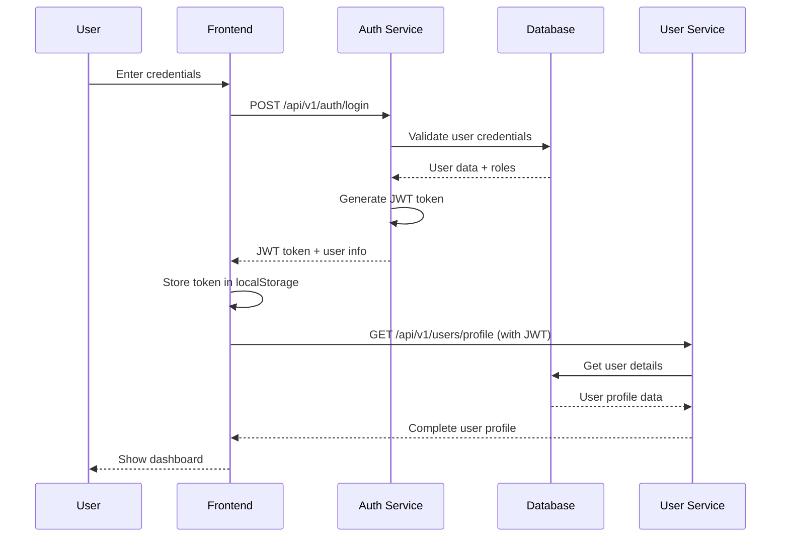

# 🏗️ Architecture Documentation

This document provides a comprehensive overview of the fullstack microservices architecture, including system design, data flow, and architectural decisions.

## 🎯 **Architecture Overview**

### **High-Level Architecture**
```
┌─────────────────┐    ┌─────────────────┐    ┌─────────────────┐
│   React Admin   │    │   Microservices │    │  Shared Database│
│   Frontend      │◄──►│   Backend       │◄──►│   Infrastructure│
│   (Port 3000)   │    │   (Ports 3001+) │    │   (Port 3306)   │
└─────────────────┘    └─────────────────┘    └─────────────────┘
```

### **Service Architecture**
```
┌─────────────────────────────────────────────────────────────────┐
│                        React Admin Frontend                     │
│  ┌─────────────┐ ┌─────────────┐ ┌─────────────┐ ┌─────────────┐│
│  │   Dashboard │ │    Users    │ │  Carriers   │ │  Customers  ││
│  └─────────────┘ └─────────────┘ └─────────────┘ └─────────────┘│
└─────────────────────────────────────────────────────────────────┘
                                │
                                ▼
┌─────────────────────────────────────────────────────────────────┐
│                    Microservices Backend                        │
│  ┌─────────────┐ ┌─────────────┐ ┌─────────────┐ ┌─────────────┐│
│  │Auth Service │ │User Service │ │Carrier Svc  │ │Customer Svc ││
│  │  :3001      │ │  :3003      │ │  :3004      │ │  :3005      ││
│  └─────────────┘ └─────────────┘ └─────────────┘ └─────────────┘│
│  ┌─────────────┐ ┌─────────────┐                                │
│  │Pricing Svc  │ │Translation  │                                │
│  │  :3006      │ │  :3007      │                                │
│  └─────────────┘ └─────────────┘                                │
└─────────────────────────────────────────────────────────────────┘
                                │
                                ▼
┌─────────────────────────────────────────────────────────────────┐
│                   Shared Infrastructure                         │
│  ┌─────────────┐ ┌─────────────┐ ┌─────────────┐                │
│  │Shared MySQL │ │Shared Redis │ │Docker Compose│                │
│  │  :3306      │ │  :6379      │ │             │                │
│  └─────────────┘ └─────────────┘ └─────────────┘                │
└─────────────────────────────────────────────────────────────────┘
```

## 🔄 **Shared Database Architecture**

### **Why Shared Database?**
The Auth and User services share the same database to:
- **Eliminate Data Duplication** - Single source of truth for user data
- **Remove Sync Issues** - No need to synchronize data between services
- **Improve Performance** - No cross-service API calls for user data
- **Simplify Architecture** - Easier to maintain and debug

### **Database Schema**
```sql
-- Shared Database: shared_user_db
CREATE DATABASE shared_user_db;

-- Users table (shared between Auth and User services)
CREATE TABLE users (
    id INT AUTO_INCREMENT PRIMARY KEY,
    email VARCHAR(255) UNIQUE NOT NULL,
    password VARCHAR(255) NOT NULL,
    first_name VARCHAR(100) NOT NULL,
    last_name VARCHAR(100) NOT NULL,
    phone VARCHAR(20),
    is_active BOOLEAN DEFAULT TRUE,
    is_email_verified BOOLEAN DEFAULT FALSE,
    last_login_at TIMESTAMP NULL,
    password_changed_at TIMESTAMP NULL,
    created_at TIMESTAMP DEFAULT CURRENT_TIMESTAMP,
    updated_at TIMESTAMP DEFAULT CURRENT_TIMESTAMP ON UPDATE CURRENT_TIMESTAMP,
    INDEX idx_email (email),
    INDEX idx_is_active (is_active),
    INDEX idx_created_at (created_at)
);

-- Roles table (shared between services)
CREATE TABLE roles (
    id INT AUTO_INCREMENT PRIMARY KEY,
    name VARCHAR(50) UNIQUE NOT NULL,
    description TEXT,
    permissions JSON,
    is_active BOOLEAN DEFAULT TRUE,
    created_at TIMESTAMP DEFAULT CURRENT_TIMESTAMP,
    updated_at TIMESTAMP DEFAULT CURRENT_TIMESTAMP ON UPDATE CURRENT_TIMESTAMP,
    INDEX idx_name (name),
    INDEX idx_is_active (is_active)
);

-- User-Roles junction table (many-to-many relationship)
CREATE TABLE user_roles (
    id INT AUTO_INCREMENT PRIMARY KEY,
    user_id INT NOT NULL,
    role_id INT NOT NULL,
    assigned_at TIMESTAMP DEFAULT CURRENT_TIMESTAMP,
    assigned_by INT,
    FOREIGN KEY (user_id) REFERENCES users(id) ON DELETE CASCADE,
    FOREIGN KEY (role_id) REFERENCES roles(id) ON DELETE CASCADE,
    FOREIGN KEY (assigned_by) REFERENCES users(id) ON DELETE SET NULL,
    UNIQUE KEY unique_user_role (user_id, role_id),
    INDEX idx_user_id (user_id),
    INDEX idx_role_id (role_id)
);
```

## 🔐 **Authentication Flow**

### **Login Process**


### **JWT Token Structure**
```json
{
  "sub": "user_id",
  "email": "user@example.com",
  "roles": ["admin", "user"],
  "iat": 1640995200,
  "exp": 1641081600
}
```

## 🌐 **Service Communication**

### **Inter-Service Communication**
```
┌─────────────┐    HTTP/REST    ┌─────────────┐
│Auth Service │◄──────────────►│User Service │
│  :3001      │                 │  :3003      │
└─────────────┘                 └─────────────┘
       │                               │
       │                               │
       ▼                               ▼
┌─────────────┐                 ┌─────────────┐
│Shared MySQL │                 │Shared MySQL │
│  :3306      │                 │  :3306      │
└─────────────┘                 └─────────────┘
```

### **API Endpoints**

#### **Auth Service (Port 3001)**
- `POST /api/v1/auth/login` - User login
- `POST /api/v1/auth/register` - User registration
- `GET /api/v1/auth/profile` - Get user profile
- `POST /api/v1/auth/refresh` - Refresh JWT token
- `GET /api/v1/auth/health` - Health check

#### **User Service (Port 3003)**
- `GET /api/v1/users` - List users
- `POST /api/v1/users` - Create user
- `GET /api/v1/users/:id` - Get user by ID
- `PUT /api/v1/users/:id` - Update user
- `DELETE /api/v1/users/:id` - Delete user
- `GET /api/v1/users/health` - Health check

## 🐳 **Container Architecture**

### **Docker Compose Structure**
```yaml
# shared-database/docker-compose.services.yml
version: '3.8'
services:
  shared-user-db:     # MySQL database
  auth-service:       # Authentication service
  user-service:       # User management service
  carrier-service:    # Carrier management service
  customer-service:   # Customer management service
  pricing-service:    # Pricing calculation service
  translation-service: # Translation service
```

### **Service Dependencies**
```
shared-user-db (Database)
    ├── auth-service
    ├── user-service
    └── [other services]

shared-redis (Cache)
    ├── auth-service
    └── [other services]
```

## 📊 **Data Flow**

### **User Registration Flow**
```
1. Frontend → Auth Service: POST /register
2. Auth Service → Database: Create user record
3. Auth Service → Database: Assign default role
4. Auth Service → Frontend: Return JWT token
5. Frontend → User Service: GET /profile (with JWT)
6. User Service → Database: Get user details
7. User Service → Frontend: Return complete profile
```

### **User Management Flow**
```
1. Frontend → User Service: GET /users
2. User Service → Database: Query users table
3. Database → User Service: Return user list
4. User Service → Frontend: Return formatted data
5. Frontend → User Service: PUT /users/:id (update)
6. User Service → Database: Update user record
7. Database → User Service: Confirm update
8. User Service → Frontend: Return updated user
```

## 🔧 **Configuration Management**

### **Environment Variables**
Each service uses environment variables for configuration:

#### **Database Configuration**
```env
DB_HOST=localhost
DB_PORT=3306
DB_USERNAME=shared_user
DB_PASSWORD=shared_password_2024
DB_NAME=shared_user_db
```

#### **JWT Configuration**
```env
JWT_SECRET=your-super-secret-jwt-key
JWT_EXPIRES_IN=24h
```

#### **Service Configuration**
```env
PORT=3001
NODE_ENV=development
FRONTEND_URL=http://localhost:3000
```

## 🚀 **Deployment Architecture**

### **Development Environment**
```
┌─────────────────┐    ┌─────────────────┐    ┌─────────────────┐
│   React Admin   │    │   Microservices │    │  Shared Database│
│   npm start     │    │   npm run dev   │    │   Docker Compose│
│   :3000         │    │   :3001-3007    │    │   :3306         │
└─────────────────┘    └─────────────────┘    └─────────────────┘
```

### **Production Environment**
```
┌─────────────────┐    ┌─────────────────┐    ┌─────────────────┐
│   Nginx Proxy   │    │   Docker Swarm  │    │  Production DB  │
│   Load Balancer │    │   Microservices │    │   MySQL Cluster │
│   SSL/TLS       │    │   Health Checks │    │   Backup        │
└─────────────────┘    └─────────────────┘    └─────────────────┘
```

## 📈 **Scalability Considerations**

### **Horizontal Scaling**
- **Stateless Services** - All services are stateless and can be scaled horizontally
- **Database Scaling** - MySQL can be scaled with read replicas
- **Load Balancing** - Nginx can distribute traffic across service instances

### **Performance Optimization**
- **Database Indexing** - Proper indexes on frequently queried columns
- **Connection Pooling** - TypeORM connection pooling for database connections
- **Caching** - Redis for session management and frequently accessed data

## 🔒 **Security Architecture**

### **Authentication & Authorization**
- **JWT Tokens** - Stateless authentication with configurable expiration
- **Role-Based Access Control** - Granular permissions based on user roles
- **Password Hashing** - bcrypt for secure password storage

### **API Security**
- **CORS Configuration** - Proper CORS setup for cross-origin requests
- **Input Validation** - Comprehensive input validation using class-validator
- **Rate Limiting** - API rate limiting to prevent abuse

## 📋 **Architecture Decisions**

### **Why Microservices?**
- **Scalability** - Individual services can be scaled independently
- **Technology Diversity** - Different services can use different technologies
- **Team Autonomy** - Teams can work independently on different services
- **Fault Isolation** - Failure in one service doesn't affect others

### **Why Shared Database for Auth/User?**
- **Data Consistency** - Single source of truth for user data
- **Performance** - No cross-service API calls for user data
- **Simplicity** - Easier to maintain and debug
- **ACID Compliance** - Database transactions ensure data integrity

### **Why NestJS?**
- **TypeScript Support** - Full TypeScript support out of the box
- **Decorator Pattern** - Clean and intuitive API design
- **Dependency Injection** - Built-in DI container for better testability
- **Modular Architecture** - Well-organized module structure

## 🔄 **Migration Strategy**

### **From Monolith to Microservices**
1. **Strangler Fig Pattern** - Gradually replace monolith components
2. **Database Decomposition** - Split database tables by service boundaries
3. **API Gateway** - Implement API gateway for service orchestration
4. **Service Discovery** - Implement service discovery for dynamic routing

### **Shared Database Migration**
1. **Create Shared Database** - Set up shared MySQL instance
2. **Update Service Configs** - Point Auth and User services to shared DB
3. **Data Migration** - Migrate existing data to shared schema
4. **Testing** - Comprehensive testing of shared database setup
5. **Deployment** - Deploy with rollback plan

---

**This architecture provides a solid foundation for a scalable, maintainable, and performant microservices application.**