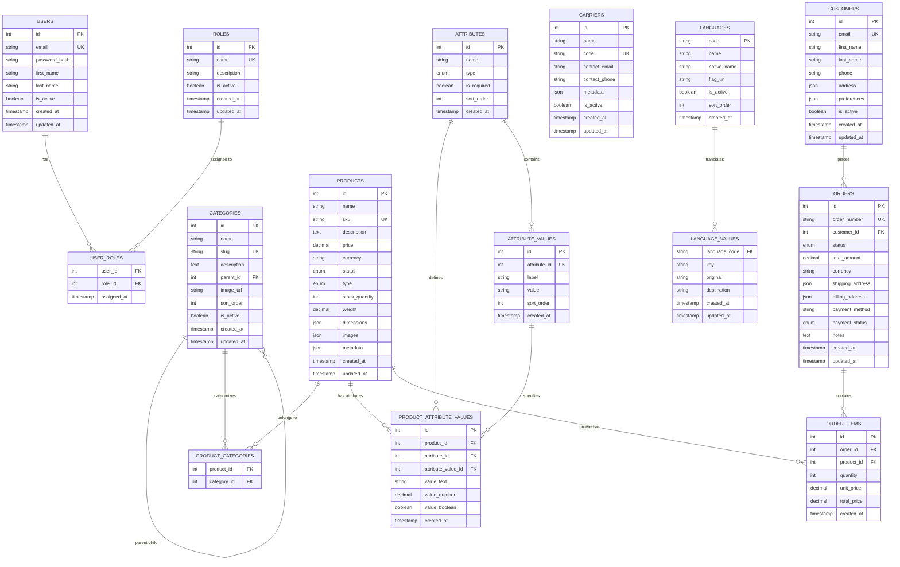

# Ecommerce Database Schema - Detailed Diagram

## Entity Relationship Diagram (ERD)



## Detailed Table Definitions

### 1. USERS Table
```sql
CREATE TABLE users (
    id INT PRIMARY KEY AUTO_INCREMENT,
    email VARCHAR(255) UNIQUE NOT NULL,
    password_hash VARCHAR(255) NOT NULL,
    first_name VARCHAR(100) NOT NULL,
    last_name VARCHAR(100) NOT NULL,
    is_active BOOLEAN DEFAULT TRUE,
    created_at TIMESTAMP DEFAULT CURRENT_TIMESTAMP,
    updated_at TIMESTAMP DEFAULT CURRENT_TIMESTAMP ON UPDATE CURRENT_TIMESTAMP,
    
    INDEX idx_email (email),
    INDEX idx_active (is_active)
);
```

### 2. ROLES Table
```sql
CREATE TABLE roles (
    id INT PRIMARY KEY AUTO_INCREMENT,
    name VARCHAR(100) UNIQUE NOT NULL,
    description TEXT,
    is_active BOOLEAN DEFAULT TRUE,
    created_at TIMESTAMP DEFAULT CURRENT_TIMESTAMP,
    updated_at TIMESTAMP DEFAULT CURRENT_TIMESTAMP ON UPDATE CURRENT_TIMESTAMP,
    
    INDEX idx_name (name),
    INDEX idx_active (is_active)
);
```

### 3. USER_ROLES Table (Junction)
```sql
CREATE TABLE user_roles (
    user_id INT NOT NULL,
    role_id INT NOT NULL,
    assigned_at TIMESTAMP DEFAULT CURRENT_TIMESTAMP,
    
    PRIMARY KEY (user_id, role_id),
    FOREIGN KEY (user_id) REFERENCES users(id) ON DELETE CASCADE,
    FOREIGN KEY (role_id) REFERENCES roles(id) ON DELETE CASCADE,
    
    INDEX idx_user (user_id),
    INDEX idx_role (role_id)
);
```

### 4. CUSTOMERS Table
```sql
CREATE TABLE customers (
    id INT PRIMARY KEY AUTO_INCREMENT,
    email VARCHAR(255) UNIQUE NOT NULL,
    first_name VARCHAR(100) NOT NULL,
    last_name VARCHAR(100) NOT NULL,
    phone VARCHAR(20),
    address JSON, -- {street, city, state, zip, country}
    preferences JSON, -- {company, newsletter, language}
    is_active BOOLEAN DEFAULT TRUE,
    created_at TIMESTAMP DEFAULT CURRENT_TIMESTAMP,
    updated_at TIMESTAMP DEFAULT CURRENT_TIMESTAMP ON UPDATE CURRENT_TIMESTAMP,
    
    INDEX idx_email (email),
    INDEX idx_active (is_active),
    INDEX idx_name (first_name, last_name)
);
```

### 5. CARRIERS Table
```sql
CREATE TABLE carriers (
    id INT PRIMARY KEY AUTO_INCREMENT,
    name VARCHAR(255) NOT NULL,
    code VARCHAR(50) UNIQUE NOT NULL,
    contact_email VARCHAR(255),
    contact_phone VARCHAR(20),
    metadata JSON, -- {tracking_url, service_types, regions}
    is_active BOOLEAN DEFAULT TRUE,
    created_at TIMESTAMP DEFAULT CURRENT_TIMESTAMP,
    updated_at TIMESTAMP DEFAULT CURRENT_TIMESTAMP ON UPDATE CURRENT_TIMESTAMP,
    
    INDEX idx_code (code),
    INDEX idx_active (is_active),
    INDEX idx_name (name)
);
```

### 6. CATEGORIES Table
```sql
CREATE TABLE categories (
    id INT PRIMARY KEY AUTO_INCREMENT,
    name VARCHAR(255) NOT NULL,
    slug VARCHAR(255) UNIQUE NOT NULL,
    description TEXT,
    parent_id INT NULL,
    image_url VARCHAR(500),
    sort_order INT DEFAULT 0,
    is_active BOOLEAN DEFAULT TRUE,
    created_at TIMESTAMP DEFAULT CURRENT_TIMESTAMP,
    updated_at TIMESTAMP DEFAULT CURRENT_TIMESTAMP ON UPDATE CURRENT_TIMESTAMP,
    
    FOREIGN KEY (parent_id) REFERENCES categories(id) ON DELETE SET NULL,
    INDEX idx_parent (parent_id),
    INDEX idx_slug (slug),
    INDEX idx_active (is_active),
    INDEX idx_sort (sort_order)
);
```

### 7. PRODUCTS Table
```sql
CREATE TABLE products (
    id INT PRIMARY KEY AUTO_INCREMENT,
    name VARCHAR(255) NOT NULL,
    sku VARCHAR(100) UNIQUE NOT NULL,
    description TEXT,
    price DECIMAL(10,2) NOT NULL,
    currency VARCHAR(3) DEFAULT 'USD',
    status ENUM('active', 'inactive', 'draft') DEFAULT 'active',
    type ENUM('simple', 'variable') DEFAULT 'simple',
    stock_quantity INT DEFAULT 0,
    weight DECIMAL(8,2),
    dimensions JSON, -- {length, width, height}
    images JSON, -- Array of image URLs
    metadata JSON, -- Additional product data
    created_at TIMESTAMP DEFAULT CURRENT_TIMESTAMP,
    updated_at TIMESTAMP DEFAULT CURRENT_TIMESTAMP ON UPDATE CURRENT_TIMESTAMP,
    
    INDEX idx_sku (sku),
    INDEX idx_status (status),
    INDEX idx_name (name),
    INDEX idx_price (price),
    INDEX idx_stock (stock_quantity),
    FULLTEXT idx_search (name, description, sku)
);
```

### 8. PRODUCT_CATEGORIES Table (Junction)
```sql
CREATE TABLE product_categories (
    product_id INT NOT NULL,
    category_id INT NOT NULL,
    
    PRIMARY KEY (product_id, category_id),
    FOREIGN KEY (product_id) REFERENCES products(id) ON DELETE CASCADE,
    FOREIGN KEY (category_id) REFERENCES categories(id) ON DELETE CASCADE,
    
    INDEX idx_product (product_id),
    INDEX idx_category (category_id)
);
```

### 9. ATTRIBUTES Table
```sql
CREATE TABLE attributes (
    id INT PRIMARY KEY AUTO_INCREMENT,
    name VARCHAR(255) NOT NULL,
    type ENUM('text', 'number', 'boolean', 'select', 'multiselect') NOT NULL,
    is_required BOOLEAN DEFAULT FALSE,
    sort_order INT DEFAULT 0,
    created_at TIMESTAMP DEFAULT CURRENT_TIMESTAMP,
    
    INDEX idx_name (name),
    INDEX idx_type (type),
    INDEX idx_sort (sort_order)
);
```

### 10. ATTRIBUTE_VALUES Table
```sql
CREATE TABLE attribute_values (
    id INT PRIMARY KEY AUTO_INCREMENT,
    attribute_id INT NOT NULL,
    label VARCHAR(255) NOT NULL,
    value VARCHAR(255) NOT NULL,
    sort_order INT DEFAULT 0,
    created_at TIMESTAMP DEFAULT CURRENT_TIMESTAMP,
    
    FOREIGN KEY (attribute_id) REFERENCES attributes(id) ON DELETE CASCADE,
    INDEX idx_attribute (attribute_id),
    INDEX idx_value (value),
    INDEX idx_sort (sort_order),
    UNIQUE KEY uk_attribute_value (attribute_id, value)
);
```

### 11. PRODUCT_ATTRIBUTE_VALUES Table (Normalized)
```sql
CREATE TABLE product_attribute_values (
    id INT PRIMARY KEY AUTO_INCREMENT,
    product_id INT NOT NULL,
    attribute_id INT NOT NULL,
    attribute_value_id INT NULL,
    value_text VARCHAR(500) NULL,
    value_number DECIMAL(15,4) NULL,
    value_boolean BOOLEAN NULL,
    created_at TIMESTAMP DEFAULT CURRENT_TIMESTAMP,
    
    FOREIGN KEY (product_id) REFERENCES products(id) ON DELETE CASCADE,
    FOREIGN KEY (attribute_id) REFERENCES attributes(id) ON DELETE CASCADE,
    FOREIGN KEY (attribute_value_id) REFERENCES attribute_values(id) ON DELETE CASCADE,
    
    INDEX idx_product_attribute (product_id, attribute_id),
    INDEX idx_attribute_value (attribute_value_id),
    INDEX idx_product_attribute_value (product_id, attribute_id, attribute_value_id),
    INDEX idx_attribute_value_product (attribute_value_id, product_id),
    INDEX idx_value_text (value_text(191)),
    INDEX idx_value_number (value_number)
);
```

### 12. ORDERS Table
```sql
CREATE TABLE orders (
    id INT PRIMARY KEY AUTO_INCREMENT,
    order_number VARCHAR(50) UNIQUE NOT NULL,
    customer_id INT NOT NULL,
    status ENUM('pending', 'processing', 'shipped', 'delivered', 'cancelled') DEFAULT 'pending',
    total_amount DECIMAL(10,2) NOT NULL,
    currency VARCHAR(3) DEFAULT 'USD',
    shipping_address JSON NOT NULL,
    billing_address JSON,
    payment_method VARCHAR(50),
    payment_status ENUM('pending', 'paid', 'failed', 'refunded') DEFAULT 'pending',
    notes TEXT,
    created_at TIMESTAMP DEFAULT CURRENT_TIMESTAMP,
    updated_at TIMESTAMP DEFAULT CURRENT_TIMESTAMP ON UPDATE CURRENT_TIMESTAMP,
    
    FOREIGN KEY (customer_id) REFERENCES customers(id),
    INDEX idx_customer (customer_id),
    INDEX idx_status (status),
    INDEX idx_order_number (order_number),
    INDEX idx_payment_status (payment_status),
    INDEX idx_created (created_at)
);
```

### 13. ORDER_ITEMS Table
```sql
CREATE TABLE order_items (
    id INT PRIMARY KEY AUTO_INCREMENT,
    order_id INT NOT NULL,
    product_id INT NOT NULL,
    quantity INT NOT NULL,
    unit_price DECIMAL(10,2) NOT NULL,
    total_price DECIMAL(10,2) NOT NULL,
    created_at TIMESTAMP DEFAULT CURRENT_TIMESTAMP,
    
    FOREIGN KEY (order_id) REFERENCES orders(id) ON DELETE CASCADE,
    FOREIGN KEY (product_id) REFERENCES products(id),
    INDEX idx_order (order_id),
    INDEX idx_product (product_id)
);
```

### 14. LANGUAGES Table
```sql
CREATE TABLE languages (
    code VARCHAR(5) PRIMARY KEY,
    name VARCHAR(100) NOT NULL,
    native_name VARCHAR(100) NOT NULL,
    flag_url VARCHAR(500),
    is_active BOOLEAN DEFAULT TRUE,
    sort_order INT DEFAULT 0,
    created_at TIMESTAMP DEFAULT CURRENT_TIMESTAMP,
    
    INDEX idx_active (is_active),
    INDEX idx_sort (sort_order)
);
```

### 15. LANGUAGE_VALUES Table
```sql
CREATE TABLE language_values (
    language_code VARCHAR(5) NOT NULL,
    key VARCHAR(255) NOT NULL,
    original TEXT NOT NULL,
    destination TEXT,
    created_at TIMESTAMP DEFAULT CURRENT_TIMESTAMP,
    updated_at TIMESTAMP DEFAULT CURRENT_TIMESTAMP ON UPDATE CURRENT_TIMESTAMP,
    
    PRIMARY KEY (language_code, key),
    FOREIGN KEY (language_code) REFERENCES languages(code) ON DELETE CASCADE,
    INDEX idx_language (language_code),
    INDEX idx_key (key)
);
```

## Key Relationships Explained

### 1. **User Management**
- `USERS` ↔ `ROLES` (Many-to-Many via `USER_ROLES`)
- One user can have multiple roles
- One role can be assigned to multiple users

### 2. **Product Categorization**
- `PRODUCTS` ↔ `CATEGORIES` (Many-to-Many via `PRODUCT_CATEGORIES`)
- One product can belong to multiple categories
- One category can contain multiple products
- `CATEGORIES` → `CATEGORIES` (Self-referencing for hierarchy)
- Categories can have parent-child relationships

### 3. **Product Attributes (Normalized)**
- `PRODUCTS` → `PRODUCT_ATTRIBUTE_VALUES` (One-to-Many)
- `ATTRIBUTES` → `PRODUCT_ATTRIBUTE_VALUES` (One-to-Many)
- `ATTRIBUTE_VALUES` → `PRODUCT_ATTRIBUTE_VALUES` (One-to-Many)
- `ATTRIBUTES` → `ATTRIBUTE_VALUES` (One-to-Many)
- **Key Design**: One row per product-attribute-value combination
- Supports both predefined values and custom text/number/boolean values

### 4. **Order Management**
- `CUSTOMERS` → `ORDERS` (One-to-Many)
- `ORDERS` → `ORDER_ITEMS` (One-to-Many)
- `PRODUCTS` → `ORDER_ITEMS` (One-to-Many)
- One customer can have multiple orders
- One order can contain multiple items
- One product can be in multiple order items

### 5. **Translation System**
- `LANGUAGES` → `LANGUAGE_VALUES` (One-to-Many)
- One language can have multiple translation values
- Uses MD5 key system for efficient lookups

## Index Strategy

### Performance Indexes
1. **Primary Keys**: All tables have auto-incrementing primary keys
2. **Unique Constraints**: Email, SKU, order_number, slug fields
3. **Foreign Key Indexes**: All foreign key columns are indexed
4. **Search Indexes**: Full-text search on products (name, description, sku)
5. **Composite Indexes**: Multi-column indexes for common query patterns
6. **Partial Indexes**: Indexes on frequently filtered columns (status, is_active)

### Query Optimization
- **Product Search**: Full-text index on products for fast search
- **Attribute Filtering**: Composite indexes on product_attribute_values
- **Category Navigation**: Indexes on category hierarchy and sorting
- **Order Management**: Indexes on order status and customer relationships

## Data Integrity Rules

### Foreign Key Constraints
- All foreign keys have proper CASCADE or SET NULL rules
- Prevents orphaned records
- Maintains referential integrity

### Check Constraints
- Price values must be positive
- Stock quantities must be non-negative
- Email formats are validated at application level
- Enum values are restricted to predefined options

### Unique Constraints
- Email addresses are unique across users and customers
- SKU codes are unique across products
- Order numbers are unique
- Category slugs are unique
- Attribute-value combinations are unique per attribute

This schema provides a robust foundation for a scalable ecommerce system with proper normalization, performance optimization, and data integrity.
