# Ecommerce Database ERD - Visual Diagram

## Complete Entity Relationship Diagram

```mermaid
erDiagram
    %% User Management
    USERS {
        int id PK "Auto Increment"
        string email UK "Unique Email"
        string password_hash "Encrypted Password"
        string first_name "User First Name"
        string last_name "User Last Name"
        boolean is_active "Account Status"
        timestamp created_at "Creation Date"
        timestamp updated_at "Last Update"
    }

    ROLES {
        int id PK "Auto Increment"
        string name UK "Role Name (admin, user, etc.)"
        string description "Role Description"
        boolean is_active "Role Status"
        timestamp created_at "Creation Date"
        timestamp updated_at "Last Update"
    }

    USER_ROLES {
        int user_id FK "References users.id"
        int role_id FK "References roles.id"
        timestamp assigned_at "Assignment Date"
    }

    %% Customer Management
    CUSTOMERS {
        int id PK "Auto Increment"
        string email UK "Customer Email"
        string first_name "Customer First Name"
        string last_name "Customer Last Name"
        string phone "Contact Phone"
        json address "Shipping Address"
        json preferences "Customer Preferences"
        boolean is_active "Customer Status"
        timestamp created_at "Creation Date"
        timestamp updated_at "Last Update"
    }

    %% Carrier Management
    CARRIERS {
        int id PK "Auto Increment"
        string name "Carrier Name"
        string code UK "Unique Carrier Code"
        string contact_email "Contact Email"
        string contact_phone "Contact Phone"
        json metadata "Carrier Metadata"
        boolean is_active "Carrier Status"
        timestamp created_at "Creation Date"
        timestamp updated_at "Last Update"
    }

    %% Category Management
    CATEGORIES {
        int id PK "Auto Increment"
        string name "Category Name"
        string slug UK "URL-friendly slug"
        text description "Category Description"
        int parent_id FK "Parent Category ID"
        string image_url "Category Image"
        int sort_order "Display Order"
        boolean is_active "Category Status"
        timestamp created_at "Creation Date"
        timestamp updated_at "Last Update"
    }

    %% Product Management
    PRODUCTS {
        int id PK "Auto Increment"
        string name "Product Name"
        string sku UK "Stock Keeping Unit"
        text description "Product Description"
        decimal price "Product Price"
        string currency "Currency Code (USD, EUR)"
        enum status "active, inactive, draft"
        enum type "simple, variable"
        int stock_quantity "Available Stock"
        decimal weight "Product Weight (kg)"
        json dimensions "Length, Width, Height"
        json images "Product Images Array"
        json metadata "Additional Product Data"
        timestamp created_at "Creation Date"
        timestamp updated_at "Last Update"
    }

    PRODUCT_CATEGORIES {
        int product_id FK "References products.id"
        int category_id FK "References categories.id"
    }

    %% Attribute System
    ATTRIBUTES {
        int id PK "Auto Increment"
        string name "Attribute Name (Color, Size, etc.)"
        enum type "text, number, boolean, select, multiselect"
        boolean is_required "Required for Products"
        int sort_order "Display Order"
        timestamp created_at "Creation Date"
    }

    ATTRIBUTE_VALUES {
        int id PK "Auto Increment"
        int attribute_id FK "References attributes.id"
        string label "Display Label (Red, Large, etc.)"
        string value "Value (red, large, etc.)"
        int sort_order "Display Order"
        timestamp created_at "Creation Date"
    }

    PRODUCT_ATTRIBUTE_VALUES {
        int id PK "Auto Increment"
        int product_id FK "References products.id"
        int attribute_id FK "References attributes.id"
        int attribute_value_id FK "References attribute_values.id"
        string value_text "Custom Text Value"
        decimal value_number "Numeric Value"
        boolean value_boolean "Boolean Value"
        timestamp created_at "Creation Date"
    }

    %% Order Management
    ORDERS {
        int id PK "Auto Increment"
        string order_number UK "Unique Order Number"
        int customer_id FK "References customers.id"
        enum status "pending, processing, shipped, delivered, cancelled"
        decimal total_amount "Order Total Amount"
        string currency "Currency Code"
        json shipping_address "Shipping Address"
        json billing_address "Billing Address"
        string payment_method "Payment Method"
        enum payment_status "pending, paid, failed, refunded"
        text notes "Order Notes"
        timestamp created_at "Order Date"
        timestamp updated_at "Last Update"
    }

    ORDER_ITEMS {
        int id PK "Auto Increment"
        int order_id FK "References orders.id"
        int product_id FK "References products.id"
        int quantity "Item Quantity"
        decimal unit_price "Price per Unit"
        decimal total_price "Total Item Price"
        timestamp created_at "Creation Date"
    }

    %% Translation System
    LANGUAGES {
        string code PK "Language Code (en, fr, es)"
        string name "Language Name"
        string native_name "Native Language Name"
        string flag_url "Flag Image URL"
        boolean is_active "Language Status"
        int sort_order "Display Order"
        timestamp created_at "Creation Date"
    }

    LANGUAGE_VALUES {
        string language_code FK "References languages.code"
        string key "Translation Key (MD5 hash)"
        string original "Original Text"
        string destination "Translated Text"
        timestamp created_at "Creation Date"
        timestamp updated_at "Last Update"
    }

    %% Relationships with Cardinality
    USERS ||--o{ USER_ROLES : "has roles"
    ROLES ||--o{ USER_ROLES : "assigned to users"
    
    CATEGORIES ||--o{ CATEGORIES : "parent-child hierarchy"
    CATEGORIES ||--o{ PRODUCT_CATEGORIES : "categorizes products"
    PRODUCTS ||--o{ PRODUCT_CATEGORIES : "belongs to categories"
    
    PRODUCTS ||--o{ PRODUCT_ATTRIBUTE_VALUES : "has attributes"
    ATTRIBUTES ||--o{ PRODUCT_ATTRIBUTE_VALUES : "defines for products"
    ATTRIBUTE_VALUES ||--o{ PRODUCT_ATTRIBUTE_VALUES : "specifies values"
    ATTRIBUTES ||--o{ ATTRIBUTE_VALUES : "contains values"
    
    CUSTOMERS ||--o{ ORDERS : "places orders"
    ORDERS ||--o{ ORDER_ITEMS : "contains items"
    PRODUCTS ||--o{ ORDER_ITEMS : "ordered as items"
    
    LANGUAGES ||--o{ LANGUAGE_VALUES : "has translations"
```

## Relationship Summary

### 🔐 **User Management**
- **USERS** ↔ **ROLES** (Many-to-Many)
- Users can have multiple roles (admin, manager, user)
- Roles can be assigned to multiple users

### 🛍️ **Product Catalog**
- **PRODUCTS** ↔ **CATEGORIES** (Many-to-Many)
- Products can belong to multiple categories
- Categories can contain multiple products
- **CATEGORIES** → **CATEGORIES** (Self-referencing)
- Hierarchical category structure (parent-child)

### 🏷️ **Product Attributes (Normalized)**
- **PRODUCTS** → **PRODUCT_ATTRIBUTE_VALUES** (One-to-Many)
- **ATTRIBUTES** → **PRODUCT_ATTRIBUTE_VALUES** (One-to-Many)
- **ATTRIBUTE_VALUES** → **PRODUCT_ATTRIBUTE_VALUES** (One-to-Many)
- **ATTRIBUTES** → **ATTRIBUTE_VALUES** (One-to-Many)
- **Key Design**: One row per product-attribute-value combination
- Supports predefined values and custom values

### 📦 **Order Management**
- **CUSTOMERS** → **ORDERS** (One-to-Many)
- **ORDERS** → **ORDER_ITEMS** (One-to-Many)
- **PRODUCTS** → **ORDER_ITEMS** (One-to-Many)
- Complete order lifecycle management

### 🌐 **Translation System**
- **LANGUAGES** → **LANGUAGE_VALUES** (One-to-Many)
- MD5 key-based translation system
- Efficient multi-language support

## Key Design Principles

### ✅ **Normalization**
- **3NF Compliance**: Eliminates data redundancy
- **Atomic Values**: Each field contains single values
- **Referential Integrity**: Foreign key constraints

### ⚡ **Performance**
- **Strategic Indexing**: Optimized for common queries
- **Composite Indexes**: Multi-column indexes for complex queries
- **Full-text Search**: Fast product search capabilities

### 🔒 **Data Integrity**
- **Foreign Key Constraints**: Prevents orphaned records
- **Unique Constraints**: Ensures data uniqueness
- **Check Constraints**: Validates data ranges and formats

### 📈 **Scalability**
- **Normalized Attributes**: Handles millions of products
- **Efficient Queries**: Sub-second response times
- **Flexible Schema**: Easy to extend with new features
