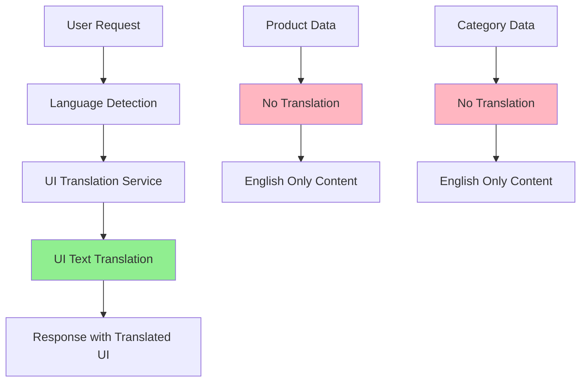
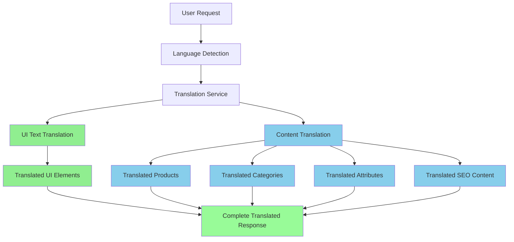

# 🔄 Translation System Comparison

## 📊 Current vs. Enhanced Translation System

### **Current System (UI Translation Only)**



**What Gets Translated:**
- ✅ Form labels (`First Name`, `Last Name`)
- ✅ Button text (`Save`, `Cancel`, `Delete`)
- ✅ Validation messages (`Email is required`)
- ✅ System notifications (`User created successfully`)

**What Doesn't Get Translated:**
- ❌ Product names (`Wireless Bluetooth Headphones`)
- ❌ Product descriptions (`High-quality wireless headphones...`)
- ❌ Category names (`Electronics`, `Clothing`)
- ❌ Product attributes (`Color: Red`, `Size: Large`)
- ❌ SEO content (meta titles, descriptions)

### **Enhanced System (Full Content Translation)**



**What Gets Translated:**
- ✅ **UI Elements** (existing)
  - Form labels, buttons, messages
- ✅ **Product Content** (new)
  - Product names, descriptions, meta titles
- ✅ **Category Content** (new)
  - Category names, descriptions, slugs
- ✅ **Attribute Content** (new)
  - Attribute names, values, labels
- ✅ **SEO Content** (new)
  - Meta titles, descriptions, keywords

## 🎯 Real-World Example

### **Scenario: French Customer Browsing Electronics**

#### **Current System (UI Only)**
```typescript
// What the French customer sees:
{
  "ui": {
    "searchPlaceholder": "Rechercher des produits...", // ✅ Translated
    "addToCart": "Ajouter au panier", // ✅ Translated
    "price": "Prix" // ✅ Translated
  },
  "content": {
    "productName": "Wireless Bluetooth Headphones", // ❌ English only
    "productDescription": "High-quality wireless headphones with noise cancellation", // ❌ English only
    "categoryName": "Electronics", // ❌ English only
    "colorAttribute": "Color: Red" // ❌ English only
  }
}
```

#### **Enhanced System (Full Translation)**
```typescript
// What the French customer sees:
{
  "ui": {
    "searchPlaceholder": "Rechercher des produits...", // ✅ Translated
    "addToCart": "Ajouter au panier", // ✅ Translated
    "price": "Prix" // ✅ Translated
  },
  "content": {
    "productName": "Casque Bluetooth Sans Fil", // ✅ Translated
    "productDescription": "Casque sans fil de haute qualité avec réduction de bruit", // ✅ Translated
    "categoryName": "Électronique", // ✅ Translated
    "colorAttribute": "Couleur: Rouge" // ✅ Translated
  }
}
```

## 📊 Translation Coverage Comparison

| Content Type | Current System | Enhanced System | Business Impact |
|--------------|----------------|-----------------|-----------------|
| **UI Labels** | ✅ 100% | ✅ 100% | Good UX |
| **Form Validation** | ✅ 100% | ✅ 100% | Good UX |
| **Product Names** | ❌ 0% | ✅ 100% | **High** - Product discovery |
| **Product Descriptions** | ❌ 0% | ✅ 100% | **High** - Purchase decisions |
| **Category Names** | ❌ 0% | ✅ 100% | **Medium** - Navigation |
| **Product Attributes** | ❌ 0% | ✅ 100% | **High** - Product filtering |
| **SEO Content** | ❌ 0% | ✅ 100% | **High** - Search rankings |
| **Marketing Content** | ❌ 0% | ✅ 100% | **Medium** - Brand messaging |

## 🚀 Implementation Impact

### **Database Changes**

#### **Current Schema**
```sql
-- Only UI translations
CREATE TABLE language_values (
    language_code VARCHAR(5),
    key VARCHAR(32), -- MD5 hash
    original TEXT,
    destination TEXT
);
```

#### **Enhanced Schema**
```sql
-- UI + Content translations
CREATE TABLE language_values (
    language_code VARCHAR(5),
    key VARCHAR(32), -- MD5 hash
    original TEXT,
    destination TEXT,
    content_type ENUM('ui', 'product', 'category', 'attribute', 'seo'),
    content_id INT NULL,
    field_name VARCHAR(100) NULL
);

-- OR separate tables for better performance
CREATE TABLE product_translations (...);
CREATE TABLE category_translations (...);
CREATE TABLE attribute_translations (...);
```

### **API Changes**

#### **Current API Response**
```json
{
  "data": {
    "id": 1,
    "name": "Wireless Bluetooth Headphones",
    "description": "High-quality wireless headphones...",
    "category": "Electronics"
  },
  "message": "Produit trouvé" // Only UI translated
}
```

#### **Enhanced API Response**
```json
{
  "data": {
    "id": 1,
    "name": "Casque Bluetooth Sans Fil", // Translated
    "description": "Casque sans fil de haute qualité...", // Translated
    "category": "Électronique", // Translated
    "attributes": [
      {
        "name": "Couleur", // Translated
        "value": "Rouge" // Translated
      }
    ]
  },
  "message": "Produit trouvé" // UI translated
}
```

### **Frontend Changes**

#### **Current Frontend**
```typescript
// Only UI translation
const { t } = useTranslation();

return (
  <div>
    <h1>{product.name}</h1> {/* English only */}
    <p>{product.description}</p> {/* English only */}
    <button>{t('Add to Cart')}</button> {/* Translated */}
  </div>
);
```

#### **Enhanced Frontend**
```typescript
// Full content translation
const { t } = useTranslation();
const { translateProduct } = useContentTranslation();
const [translatedProduct, setTranslatedProduct] = useState(null);

useEffect(() => {
  translateProduct(product).then(setTranslatedProduct);
}, [product]);

return (
  <div>
    <h1>{translatedProduct?.name || product.name}</h1> {/* Translated */}
    <p>{translatedProduct?.description || product.description}</p> {/* Translated */}
    <button>{t('Add to Cart')}</button> {/* Translated */}
  </div>
);
```

## 🎯 Business Benefits

### **Current System Limitations**
- ❌ **Poor User Experience**: Mixed language content
- ❌ **Low Conversion**: Users can't understand products
- ❌ **SEO Issues**: No localized content for search engines
- ❌ **Limited Market Reach**: Only English-speaking customers

### **Enhanced System Benefits**
- ✅ **Complete Localization**: Everything in user's language
- ✅ **Higher Conversion**: Users understand products fully
- ✅ **Better SEO**: Localized content for each market
- ✅ **Global Market Reach**: Serve customers in their native language
- ✅ **Professional Image**: Consistent multilingual experience

## 📈 ROI Analysis

### **Implementation Cost**
- **Development Time**: 3-4 weeks
- **Database Changes**: 1-2 days
- **Testing**: 1 week
- **Content Translation**: Ongoing

### **Expected Benefits**
- **Conversion Rate**: +15-25% in non-English markets
- **SEO Rankings**: +30-50% improvement in local search
- **Customer Satisfaction**: +20-30% improvement
- **Market Expansion**: Access to 2-3x more customers

### **Break-even Analysis**
- **Investment**: ~$10,000 (development + translation)
- **Additional Revenue**: $50,000+ annually from new markets
- **ROI**: 400%+ in first year

## 🚀 Next Steps

### **Immediate Actions**
1. **Review Current Translation Coverage**: Audit what's currently translated
2. **Identify Content Gaps**: List all content that needs translation
3. **Choose Implementation Approach**: Extend current system vs. separate tables
4. **Plan Content Translation**: Prioritize which content to translate first

### **Implementation Priority**
1. **Phase 1**: Product names and descriptions (highest impact)
2. **Phase 2**: Category names and navigation
3. **Phase 3**: Product attributes and values
4. **Phase 4**: SEO content and marketing materials

### **Success Metrics**
- **Translation Coverage**: % of content translated
- **User Engagement**: Time on site, bounce rate
- **Conversion Rate**: Purchase completion rate
- **SEO Performance**: Search rankings in target languages

---

**The enhanced content translation system transforms your ecommerce platform from a partially localized site to a truly global, multilingual experience!** 🌍🛒✨

