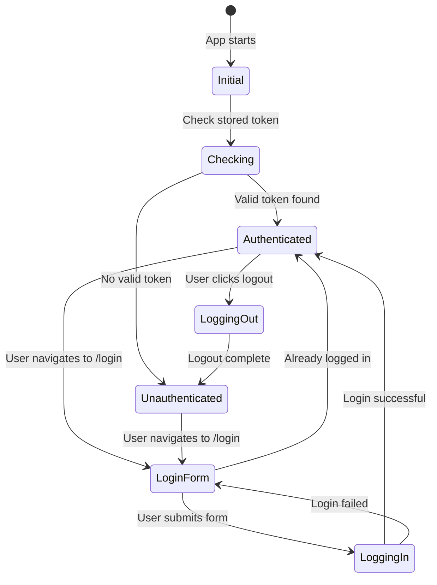
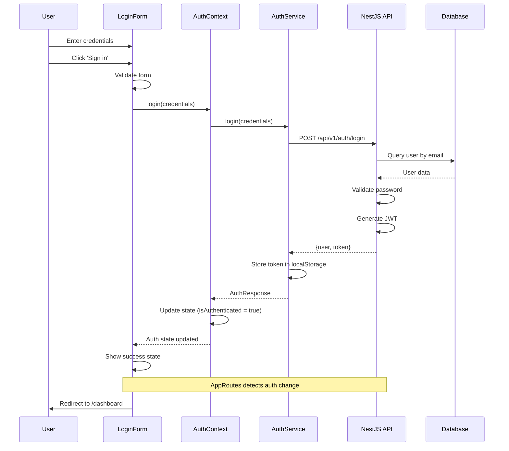
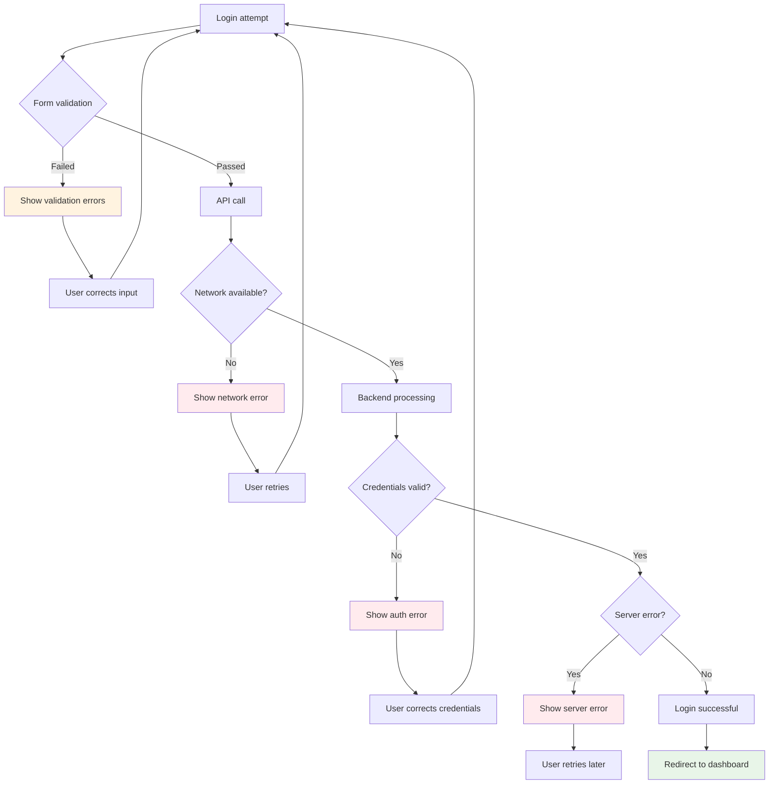
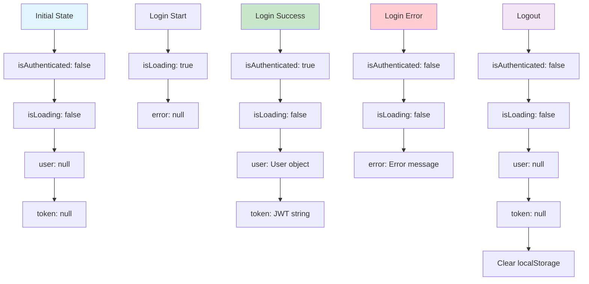
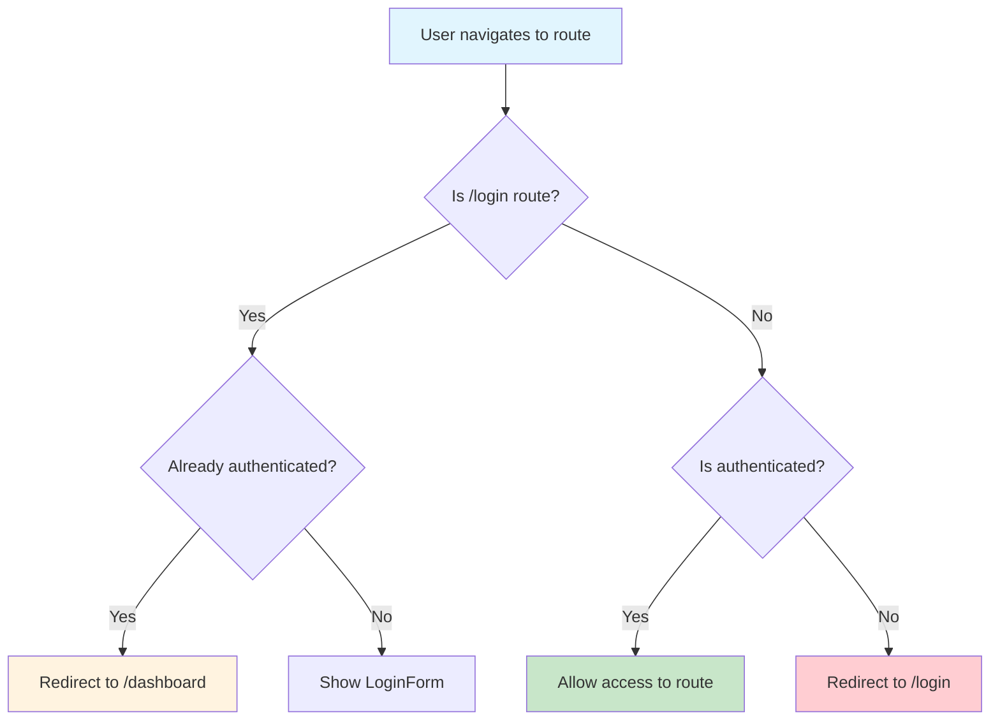
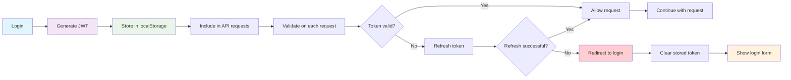
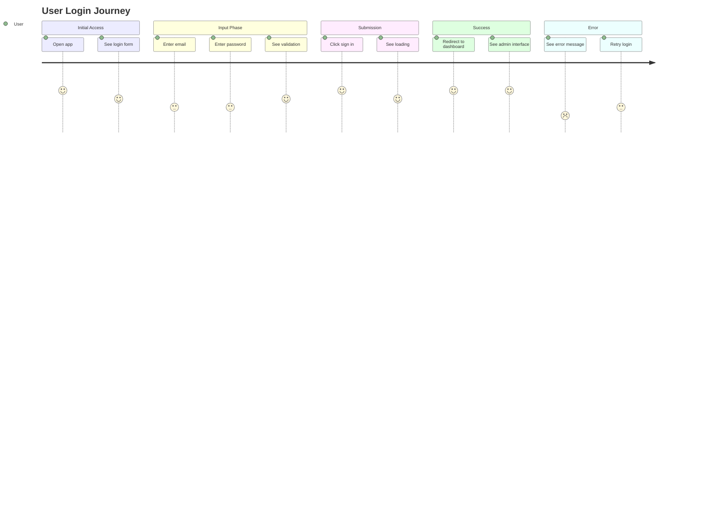

# 🔐 Login Flow - Mermaid Diagram

## Complete Login Flow Diagram

```mermaid
graph TD
    A[User opens /login] --> B[LoginForm renders]
    B --> C[User enters email & password]
    C --> D[User clicks 'Sign in']
    D --> E[Form validation]
    E --> F{Validation passed?}
    F -->|No| G[Show validation errors]
    G --> C
    F -->|Yes| H[Call useAuth.login()]
    H --> I[Set isLoading = true]
    I --> J[Call authService.login()]
    J --> K[HTTP POST to /api/v1/auth/login]
    K --> L[Backend AuthController]
    L --> M[Validate credentials]
    M --> N{Credentials valid?}
    N -->|No| O[Return 401 Unauthorized]
    O --> P[Show error message]
    P --> C
    N -->|Yes| Q[Generate JWT token]
    Q --> R[Return {user, token}]
    R --> S[Store token in localStorage]
    S --> T[Update auth state]
    T --> U[Set isAuthenticated = true]
    U --> V[AppRoutes detects auth change]
    V --> W[Redirect to /dashboard]
    W --> X[Dashboard renders]
    
    style A fill:#e1f5fe
    style X fill:#c8e6c9
    style P fill:#ffcdd2
    style G fill:#fff3e0
```

## Authentication State Flow



## Component Interaction Flow



## Error Handling Flow



## Security Flow

```mermaid
graph LR
    A[User credentials] --> B[Client validation]
    B --> C[HTTPS request]
    C --> D[Backend validation]
    D --> E[Password hash check]
    E --> F[JWT generation]
    F --> G[Secure token storage]
    G --> H[Protected routes]
    H --> I[Token validation]
    I --> J[API access]
    
    style A fill:#e3f2fd
    style F fill:#f3e5f5
    style G fill:#e8f5e8
    style J fill:#fff3e0
```



## State Management Flow



## Route Protection Flow



## Token Lifecycle



## User Experience Flow



This comprehensive flow diagram shows the complete login process in your React admin application, from user interaction to backend processing and state management.

