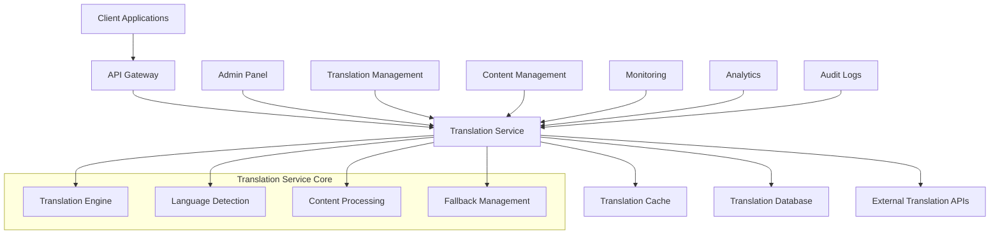

# 🌍 Real-World Translation Service Design - Best Practices

## 📋 Overview

This document outlines the **best practices** for designing a translation service in real-world applications, based on industry standards, production experience, and scalability requirements.

## 🎯 Real-World Translation Service Architecture

### **Production-Grade Architecture**



## 🏗️ Core Design Principles

### **1. Separation of Concerns**

```typescript
// ✅ GOOD: Separate services for different responsibilities
interface TranslationService {
  // Core translation
  translate(text: string, language: string): Promise<string>;
  translateContent(content: any, language: string): Promise<any>;
  
  // Language management
  getSupportedLanguages(): Promise<Language[]>;
  detectLanguage(text: string): Promise<string>;
  
  // Cache management
  clearCache(language?: string): Promise<void>;
  preloadTranslations(language: string): Promise<void>;
}

interface TranslationManagementService {
  // Admin operations
  addTranslation(translation: TranslationRequest): Promise<Translation>;
  updateTranslation(id: string, translation: TranslationRequest): Promise<Translation>;
  deleteTranslation(id: string): Promise<void>;
  
  // Bulk operations
  importTranslations(translations: TranslationRequest[]): Promise<Translation[]>;
  exportTranslations(language: string): Promise<Translation[]>;
  
  // Approval workflow
  approveTranslation(id: string): Promise<void>;
  rejectTranslation(id: string, reason: string): Promise<void>;
}

interface TranslationAnalyticsService {
  // Usage analytics
  getTranslationStats(language: string, period: string): Promise<TranslationStats>;
  getMissingTranslations(language: string): Promise<MissingTranslation[]>;
  getPopularTranslations(language: string): Promise<PopularTranslation[]>;
}
```

### **2. Multi-Layer Caching Strategy**

```typescript
interface TranslationCache {
  // L1: In-memory cache (fastest)
  get(key: string): Promise<string | null>;
  set(key: string, value: string, ttl: number): Promise<void>;
  
  // L2: Redis cache (distributed)
  getDistributed(key: string): Promise<string | null>;
  setDistributed(key: string, value: string, ttl: number): Promise<void>;
  
  // L3: CDN cache (global)
  invalidateCDN(pattern: string): Promise<void>;
}

@Injectable()
export class MultiLayerTranslationCache implements TranslationCache {
  constructor(
    private memoryCache: MemoryCache,
    private redisCache: RedisCache,
    private cdnCache: CDNCache
  ) {}

  async get(key: string): Promise<string | null> {
    // L1: Check memory cache first
    let value = await this.memoryCache.get(key);
    if (value) return value;

    // L2: Check Redis cache
    value = await this.redisCache.get(key);
    if (value) {
      // Populate L1 cache
      await this.memoryCache.set(key, value, 300); // 5 minutes
      return value;
    }

    // L3: Check CDN cache
    value = await this.cdnCache.get(key);
    if (value) {
      // Populate L1 and L2 caches
      await this.memoryCache.set(key, value, 300);
      await this.redisCache.set(key, value, 3600); // 1 hour
      return value;
    }

    return null;
  }
}
```

### **3. Fallback Strategy**

```typescript
interface TranslationFallbackStrategy {
  // Primary: Database translation
  // Secondary: External API (Google Translate, DeepL)
  // Tertiary: AI translation (GPT, Claude)
  // Final: Original text with language marker
}

@Injectable()
export class TranslationFallbackService {
  constructor(
    private databaseService: TranslationDatabaseService,
    private googleTranslateService: GoogleTranslateService,
    private aiTranslationService: AITranslationService
  ) {}

  async translateWithFallback(
    text: string, 
    targetLanguage: string
  ): Promise<TranslationResult> {
    try {
      // 1. Try database translation
      const dbTranslation = await this.databaseService.getTranslation(text, targetLanguage);
      if (dbTranslation) {
        return {
          text: dbTranslation.destination,
          source: 'database',
          confidence: 1.0,
          timestamp: new Date()
        };
      }

      // 2. Try external API
      const apiTranslation = await this.googleTranslateService.translate(text, targetLanguage);
      if (apiTranslation) {
        // Store in database for future use
        await this.databaseService.addTranslation({
          original: text,
          destination: apiTranslation.text,
          language: targetLanguage,
          source: 'google_translate',
          confidence: apiTranslation.confidence
        });

        return {
          text: apiTranslation.text,
          source: 'google_translate',
          confidence: apiTranslation.confidence,
          timestamp: new Date()
        };
      }

      // 3. Try AI translation
      const aiTranslation = await this.aiTranslationService.translate(text, targetLanguage);
      if (aiTranslation) {
        return {
          text: aiTranslation.text,
          source: 'ai',
          confidence: aiTranslation.confidence,
          timestamp: new Date()
        };
      }

      // 4. Final fallback: return original with language marker
      return {
        text: `[${targetLanguage.toUpperCase()}] ${text}`,
        source: 'fallback',
        confidence: 0.0,
        timestamp: new Date()
      };

    } catch (error) {
      console.error('Translation fallback failed:', error);
      return {
        text: text,
        source: 'error',
        confidence: 0.0,
        timestamp: new Date()
      };
    }
  }
}
```

## 🚀 Production-Ready Implementation

### **1. Translation Service with Enterprise Features**

```typescript
@Injectable()
export class ProductionTranslationService {
  constructor(
    private cache: MultiLayerTranslationCache,
    private fallbackService: TranslationFallbackService,
    private analyticsService: TranslationAnalyticsService,
    private auditService: AuditService,
    private rateLimitService: RateLimitService
  ) {}

  async translate(
    text: string,
    targetLanguage: string,
    context?: TranslationContext
  ): Promise<TranslationResult> {
    // 1. Rate limiting
    await this.rateLimitService.checkLimit(context?.userId, 'translation');

    // 2. Input validation
    this.validateTranslationRequest(text, targetLanguage);

    // 3. Check cache
    const cacheKey = this.generateCacheKey(text, targetLanguage);
    const cachedResult = await this.cache.get(cacheKey);
    if (cachedResult) {
      await this.analyticsService.recordCacheHit(targetLanguage);
      return JSON.parse(cachedResult);
    }

    // 4. Perform translation with fallback
    const result = await this.fallbackService.translateWithFallback(text, targetLanguage);

    // 5. Cache result
    await this.cache.set(cacheKey, JSON.stringify(result), this.getCacheTTL(result.confidence));

    // 6. Record analytics
    await this.analyticsService.recordTranslation(text, targetLanguage, result);

    // 7. Audit log
    await this.auditService.logTranslation({
      text,
      targetLanguage,
      result,
      userId: context?.userId,
      timestamp: new Date()
    });

    return result;
  }

  private validateTranslationRequest(text: string, language: string): void {
    if (!text || text.length === 0) {
      throw new BadRequestException('Text cannot be empty');
    }

    if (text.length > 10000) {
      throw new BadRequestException('Text too long (max 10,000 characters)');
    }

    if (!this.isValidLanguage(language)) {
      throw new BadRequestException(`Unsupported language: ${language}`);
    }
  }

  private getCacheTTL(confidence: number): number {
    // Higher confidence = longer cache TTL
    if (confidence >= 0.9) return 86400; // 24 hours
    if (confidence >= 0.7) return 3600;  // 1 hour
    return 300; // 5 minutes
  }
}
```

### **2. Content Translation with Context Awareness**

```typescript
interface TranslationContext {
  userId?: string;
  domain?: string; // 'ecommerce', 'cms', 'admin'
  contentType?: string; // 'product', 'category', 'user'
  fieldType?: string; // 'name', 'description', 'title'
  metadata?: Record<string, any>;
}

@Injectable()
export class ContextAwareTranslationService {
  async translateContent(
    content: any,
    targetLanguage: string,
    context?: TranslationContext
  ): Promise<any> {
    if (!content) return content;

    const translatedContent = { ...content };

    // Apply domain-specific translation rules
    const rules = await this.getTranslationRules(context?.domain, context?.contentType);
    
    for (const [field, value] of Object.entries(content)) {
      if (this.shouldTranslateField(field, value, rules)) {
        const fieldContext = {
          ...context,
          fieldType: field,
          contentType: context?.contentType
        };

        translatedContent[field] = await this.translate(
          value,
          targetLanguage,
          fieldContext
        );
      }
    }

    return translatedContent;
  }

  private async getTranslationRules(domain?: string, contentType?: string): Promise<TranslationRules> {
    // Load rules from database or configuration
    return {
      translatableFields: ['name', 'title', 'description', 'firstName', 'lastName'],
      skipFields: ['id', 'email', 'phone', 'sku', 'code'],
      contextSpecific: {
        ecommerce: {
          product: {
            translatableFields: ['name', 'description', 'metaTitle', 'metaDescription'],
            skipFields: ['sku', 'price', 'weight']
          }
        }
      }
    };
  }
}
```

### **3. Translation Management with Workflow**

```typescript
interface TranslationWorkflow {
  // States: pending, in_review, approved, rejected, published
  state: TranslationState;
  assignedTo?: string;
  reviewer?: string;
  comments?: Comment[];
  metadata?: Record<string, any>;
}

@Injectable()
export class TranslationManagementService {
  async addTranslation(request: TranslationRequest): Promise<Translation> {
    // 1. Validate request
    this.validateTranslationRequest(request);

    // 2. Check for duplicates
    const existing = await this.findDuplicateTranslation(request);
    if (existing) {
      throw new ConflictException('Translation already exists');
    }

    // 3. Create translation with workflow
    const translation = await this.translationRepository.create({
      ...request,
      state: 'pending',
      createdAt: new Date(),
      updatedAt: new Date()
    });

    // 4. Assign to reviewer based on rules
    const reviewer = await this.assignReviewer(translation);
    if (reviewer) {
      translation.assignedTo = reviewer;
      await this.notificationService.notifyReviewer(reviewer, translation);
    }

    // 5. Auto-approve if confidence is high
    if (request.confidence && request.confidence > 0.95) {
      await this.approveTranslation(translation.id);
    }

    return translation;
  }

  async approveTranslation(id: string, reviewerId: string): Promise<void> {
    const translation = await this.translationRepository.findById(id);
    
    // 1. Update state
    translation.state = 'approved';
    translation.reviewer = reviewerId;
    translation.approvedAt = new Date();
    
    // 2. Save to database
    await this.translationRepository.save(translation);
    
    // 3. Invalidate cache
    await this.cache.invalidate(this.generateCacheKey(translation.original, translation.language));
    
    // 4. Notify stakeholders
    await this.notificationService.notifyApproval(translation);
    
    // 5. Update analytics
    await this.analyticsService.recordApproval(translation);
  }
}
```

## 📊 Database Design for Production

### **Optimized Database Schema**

```sql
-- Languages table
CREATE TABLE languages (
    code VARCHAR(5) PRIMARY KEY,
    name VARCHAR(100) NOT NULL,
    native_name VARCHAR(100) NOT NULL,
    is_active BOOLEAN DEFAULT TRUE,
    is_rtl BOOLEAN DEFAULT FALSE,
    sort_order INT DEFAULT 0,
    created_at TIMESTAMP DEFAULT CURRENT_TIMESTAMP,
    updated_at TIMESTAMP DEFAULT CURRENT_TIMESTAMP ON UPDATE CURRENT_TIMESTAMP,
    
    INDEX idx_active (is_active),
    INDEX idx_sort (sort_order)
);

-- Translations table with enhanced fields
CREATE TABLE translations (
    id VARCHAR(36) PRIMARY KEY,
    key VARCHAR(32) NOT NULL, -- MD5 hash
    language_code VARCHAR(5) NOT NULL,
    original TEXT NOT NULL,
    destination TEXT NOT NULL,
    
    -- Translation metadata
    source VARCHAR(50) DEFAULT 'manual', -- manual, google_translate, ai, import
    confidence DECIMAL(3,2) DEFAULT 1.00,
    context JSON, -- Additional context information
    
    -- Workflow fields
    state ENUM('pending', 'in_review', 'approved', 'rejected', 'published') DEFAULT 'pending',
    assigned_to VARCHAR(36),
    reviewer VARCHAR(36),
    approved_at TIMESTAMP NULL,
    
    -- Audit fields
    created_by VARCHAR(36),
    updated_by VARCHAR(36),
    created_at TIMESTAMP DEFAULT CURRENT_TIMESTAMP,
    updated_at TIMESTAMP DEFAULT CURRENT_TIMESTAMP ON UPDATE CURRENT_TIMESTAMP,
    
    FOREIGN KEY (language_code) REFERENCES languages(code),
    UNIQUE KEY unique_translation (key, language_code),
    
    INDEX idx_language_state (language_code, state),
    INDEX idx_assigned_to (assigned_to),
    INDEX idx_reviewer (reviewer),
    INDEX idx_created_at (created_at),
    INDEX idx_confidence (confidence),
    FULLTEXT idx_search (original, destination)
);

-- Translation comments for workflow
CREATE TABLE translation_comments (
    id VARCHAR(36) PRIMARY KEY,
    translation_id VARCHAR(36) NOT NULL,
    user_id VARCHAR(36) NOT NULL,
    comment TEXT NOT NULL,
    created_at TIMESTAMP DEFAULT CURRENT_TIMESTAMP,
    
    FOREIGN KEY (translation_id) REFERENCES translations(id) ON DELETE CASCADE,
    INDEX idx_translation (translation_id),
    INDEX idx_user (user_id)
);

-- Translation analytics
CREATE TABLE translation_analytics (
    id VARCHAR(36) PRIMARY KEY,
    translation_id VARCHAR(36) NOT NULL,
    language_code VARCHAR(5) NOT NULL,
    usage_count INT DEFAULT 0,
    last_used_at TIMESTAMP NULL,
    created_at TIMESTAMP DEFAULT CURRENT_TIMESTAMP,
    updated_at TIMESTAMP DEFAULT CURRENT_TIMESTAMP ON UPDATE CURRENT_TIMESTAMP,
    
    FOREIGN KEY (translation_id) REFERENCES translations(id) ON DELETE CASCADE,
    UNIQUE KEY unique_analytics (translation_id, language_code),
    INDEX idx_usage_count (usage_count),
    INDEX idx_last_used (last_used_at)
);
```

## 🔧 Performance Optimization

### **1. Caching Strategy**

```typescript
@Injectable()
export class TranslationCacheService {
  constructor(
    private redis: Redis,
    private memoryCache: Map<string, any>
  ) {}

  async get(key: string): Promise<string | null> {
    // L1: Memory cache (fastest)
    if (this.memoryCache.has(key)) {
      return this.memoryCache.get(key);
    }

    // L2: Redis cache
    const value = await this.redis.get(key);
    if (value) {
      this.memoryCache.set(key, value);
      return value;
    }

    return null;
  }

  async set(key: string, value: string, ttl: number): Promise<void> {
    // Set in both caches
    this.memoryCache.set(key, value);
    await this.redis.setex(key, ttl, value);
  }

  async preloadLanguage(language: string): Promise<void> {
    // Preload all translations for a language
    const translations = await this.translationRepository.findByLanguage(language);
    
    const pipeline = this.redis.pipeline();
    translations.forEach(translation => {
      const key = this.generateCacheKey(translation.original, language);
      pipeline.setex(key, 86400, translation.destination); // 24 hours
    });
    
    await pipeline.exec();
  }
}
```

### **2. Batch Processing**

```typescript
@Injectable()
export class BatchTranslationService {
  async translateBatch(
    texts: string[],
    targetLanguage: string,
    context?: TranslationContext
  ): Promise<TranslationResult[]> {
    // 1. Check cache for existing translations
    const cacheResults = await this.getCachedTranslations(texts, targetLanguage);
    
    // 2. Identify missing translations
    const missingTexts = texts.filter((text, index) => !cacheResults[index]);
    
    // 3. Batch translate missing texts
    const newTranslations = await this.batchTranslate(missingTexts, targetLanguage);
    
    // 4. Combine results
    const results: TranslationResult[] = [];
    let newIndex = 0;
    
    texts.forEach((text, index) => {
      if (cacheResults[index]) {
        results.push(cacheResults[index]);
      } else {
        results.push(newTranslations[newIndex++]);
      }
    });
    
    return results;
  }

  private async batchTranslate(
    texts: string[],
    targetLanguage: string
  ): Promise<TranslationResult[]> {
    // Use external API batch translation
    const batchSize = 100;
    const results: TranslationResult[] = [];
    
    for (let i = 0; i < texts.length; i += batchSize) {
      const batch = texts.slice(i, i + batchSize);
      const batchResults = await this.externalTranslationService.translateBatch(batch, targetLanguage);
      results.push(...batchResults);
    }
    
    return results;
  }
}
```

## 🛡️ Security and Compliance

### **1. Data Protection**

```typescript
@Injectable()
export class SecureTranslationService {
  async translate(
    text: string,
    targetLanguage: string,
    context?: TranslationContext
  ): Promise<TranslationResult> {
    // 1. Sanitize input
    const sanitizedText = this.sanitizeInput(text);
    
    // 2. Check for sensitive data
    if (this.containsSensitiveData(sanitizedText)) {
      throw new ForbiddenException('Text contains sensitive information');
    }
    
    // 3. Log for audit
    await this.auditService.logTranslationRequest({
      text: this.maskSensitiveData(sanitizedText),
      targetLanguage,
      userId: context?.userId,
      timestamp: new Date()
    });
    
    // 4. Perform translation
    return this.performTranslation(sanitizedText, targetLanguage);
  }

  private containsSensitiveData(text: string): boolean {
    // Check for PII, credit card numbers, etc.
    const sensitivePatterns = [
      /\b\d{4}[-\s]?\d{4}[-\s]?\d{4}[-\s]?\d{4}\b/, // Credit card
      /\b\d{3}-\d{2}-\d{4}\b/, // SSN
      /\b[A-Za-z0-9._%+-]+@[A-Za-z0-9.-]+\.[A-Z|a-z]{2,}\b/ // Email
    ];
    
    return sensitivePatterns.some(pattern => pattern.test(text));
  }
}
```

### **2. Rate Limiting and Throttling**

```typescript
@Injectable()
export class TranslationRateLimitService {
  async checkLimit(userId: string, operation: string): Promise<void> {
    const key = `rate_limit:${userId}:${operation}`;
    const current = await this.redis.incr(key);
    
    if (current === 1) {
      await this.redis.expire(key, 3600); // 1 hour window
    }
    
    const limit = this.getLimit(operation);
    if (current > limit) {
      throw new TooManyRequestsException(`Rate limit exceeded for ${operation}`);
    }
  }

  private getLimit(operation: string): number {
    const limits = {
      translation: 1000, // 1000 translations per hour
      batch_translation: 100, // 100 batch operations per hour
      admin_operation: 500 // 500 admin operations per hour
    };
    
    return limits[operation] || 100;
  }
}
```

## 📈 Monitoring and Analytics

### **1. Translation Metrics**

```typescript
@Injectable()
export class TranslationMetricsService {
  async recordTranslation(
    text: string,
    targetLanguage: string,
    result: TranslationResult
  ): Promise<void> {
    const metrics = {
      language: targetLanguage,
      source: result.source,
      confidence: result.confidence,
      textLength: text.length,
      timestamp: new Date(),
      responseTime: result.responseTime
    };
    
    // Send to analytics service
    await this.analyticsService.track('translation_performed', metrics);
    
    // Update database analytics
    await this.updateTranslationAnalytics(text, targetLanguage);
  }

  async getTranslationStats(period: string): Promise<TranslationStats> {
    return {
      totalTranslations: await this.getTotalTranslations(period),
      averageConfidence: await this.getAverageConfidence(period),
      topLanguages: await this.getTopLanguages(period),
      cacheHitRate: await this.getCacheHitRate(period),
      errorRate: await this.getErrorRate(period)
    };
  }
}
```

## 🎯 Best Practices Summary

### **✅ Do's**

1. **Separate Concerns**: Different services for translation, management, and analytics
2. **Multi-Layer Caching**: Memory + Redis + CDN for optimal performance
3. **Fallback Strategy**: Database → External API → AI → Original text
4. **Context Awareness**: Consider domain, content type, and field type
5. **Workflow Management**: Proper approval and review process
6. **Security**: Sanitize input, protect sensitive data, audit logs
7. **Performance**: Batch processing, rate limiting, preloading
8. **Monitoring**: Comprehensive metrics and analytics

### **❌ Don'ts**

1. **Don't** store translations in application memory only
2. **Don't** translate sensitive data without proper handling
3. **Don't** ignore fallback strategies
4. **Don't** skip input validation and sanitization
5. **Don't** forget about rate limiting and abuse prevention
6. **Don't** ignore performance optimization
7. **Don't** skip monitoring and analytics
8. **Don't** hardcode language lists or translation rules

---

**This production-ready design provides a robust, scalable, and secure translation service for real-world applications!** 🌍✨

